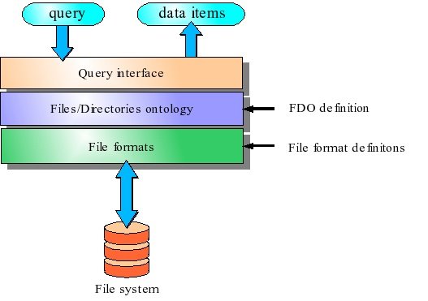
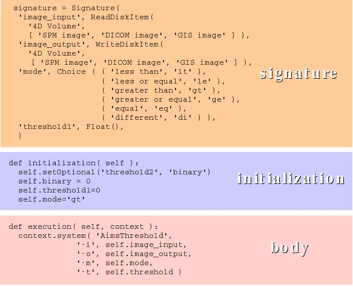
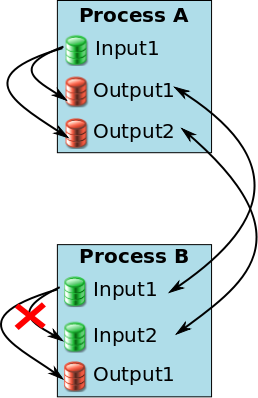
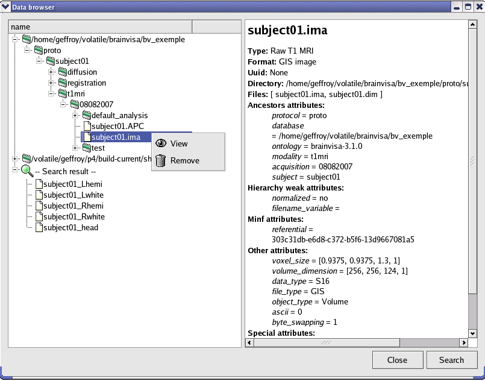

=====================
Axon developer manual
=====================

Introduction
============

This document should teach how to program BrainVisa and to create custom processes. The audience is supposed to be familiar with `Python language <http://python.org>`_.

If you are not, you are encouraged to look at the `Python tutorial <https://docs.python.org/tutorial/index.html>`_ and the `Python documentation <http://docs.python.org>`_.

Data management
---------------

The data management interface allows to organize data stored on a file system according to a (possibly user-defined) ontology. A *BrainVisa* user can provide a *files and directories ontology* (**FDO**) that is associated with a directory to define the organization of the whole directory's content (including sub-directories). The *FDO* contains naming conventions that allow to identify any file according to an ontology. *BrainVisa* provides a database system which is based on *FDO*. This system is organized in three layers (See the :ref:`figure below <figDataManagementSystem>`):

* File formats

  This layer groups the files in data items according to a set of file format definitions. All files corresponding to the same data are grouped in a single data item. For example, a data item can represent the header file (``*.hdr``) and the data file (``*.img``) of an *Analyze* format image, or it can represent a set of *DICOM* files composing one MR acquisition.

* Files/Directories ontology

  This layer uses an *FDO* definition to identify the data items. It sets the  item's data type and the item's ontology attributes. The data type identifies the contents of a data item (image, mesh, functional image, anatomical MRI, etc). The data types are organized in a hierarchy making it possible to decline a generic type in several specialized types. For example, there is a **4D Image** type which is specialized in **3D Image** (indeed, a three-dimensional image is a particular case of a four-dimensional one); the type **3D Image** is itself declined in several types, of which **T1 MRI** and **Brain mask** both belong indirectly. The ontology attributes define the way the data items are grouped and linked together. For example, all the data from one *center* could have the same value for the *center* attribute.

* Query interface

  This layer is the user entry point to the *BrainVisa* database system. It provides a query system that rely on data type and ontology attributes. A data query is composed of a file type and a set of attributes filters. The result of a query is a set of data items. For example, querying for data of type **T1 MRI** with attribute *subject* equal to ``John Doe`` would return all T1-weighted exams of John Doe (provided that the *FDO* of the database defines a type named **T1 MRI** and a *subject* attribute).

.. _figDataManagementSystem:

  Architecture of *BrainVisa* data management system.

Software management
-------------------

The software management system contains the architecture for the integration of various programs and libraries in a common environment. It provides a developpement environement that facilitates the integration of neuroimaging data processing or visualization software. This integration is done via a set of **processes**. A *process* is a Python script that declares its input and output parameters, it is composed of three parts (See the :ref:`figure below <figTresholdProcess>`):

* Signature

  The signature contains the definition of its parameters. A parameter has a name and a type. The knowledge of the parameter type makes it possible to *BrainVisa* to automatically generate a graphical interface to select values for the parameter. Some parameter types are related to the data management system and allows to select only specific values in the database. For instance it is possible to build a parameter that will only accept normalized fMRI images. In the example of :ref:`the figure here <figTresholdProcess>`, the *image_input* parameter only accepts data of type **4D Volume**, therefore *BrainVisa* will raise an error if this process is called with an inappropriate data type such as a *mesh*.

* Initialization

  An initialization function called whenever a new instance of this process is created. It allows, for example, to set the default values of the parameters.

* Body

  The body is a function which is the entry point for the process execution. In the threshold example of the :ref:`figure <figTresholdProcess>`, it calls an external command-line program (``AimsThreshold``) to actually perform the thresholding.

.. _figTresholdProcess:

  An example of a simple BrainVISA process: thresholding an image

.. _data:

Data ontology
=============

*BrainVisa* uses a data ontology to organize its databases. This ontology describes data types, and the name and place of each data in the file system according to its type. *BrainVisa* has a default ontology but it is possible to complete it or to create another one.

Data ontology is described through:

* *types* files that contain data types and formats
* *hierarchies* files that contain rules to associate name, place in file system and attributes to each data type.

Types
-----

Types files are in the ``brainvisa/types`` directory or in the types directory of a toolbox (See :ref:`toolboxes`). They describe all data types and formats that will be recognized by *BrainVisa*. These files are written in Python. It is not mandatory to write several files but it is more practical to organize information. When a file uses types or formats described in another file, it is necessary to include a reference to this file. For example, ``registration.py`` uses ``builtin.py``, so ``registration.py`` begins with:

::

  include('builtin')

* Format

  A format is defined by a name and a pattern to identify files in this format. Generally the data format can be found with the files extensions. Some data may exist in different formats. For example, an MRI image can be written in *Analyze*, *GIS*, *NIFTI* formats...

  ::

    Format(format name, list of the patterns, [attributes])

  Example:

  ::

    Format('GIS image', ["f|*.ima", "f|*.dim"])

  In this example, the *GIS* image format defines a couple of files, one with ``.ima`` extension  and the other with ``.dim`` extension.

  A pattern begins with ``"f|"`` to match a file or with ``"d|"`` to match a directory. In the rest of the pattern, ``"*"`` stands for any string.

  .. currentmodule:: brainvisa.data.neuroDiskItems

  The above code lines creates an instance of the class :py:class:`Format` which is defined in the module :py:mod:`brainvisa.data.neuroDiskItems`. At startup, *BrainVisa* loads all formats. It is possible to retrieve a particular format by its name using the function :py:func:`getFormat` or to get all existing formats with :py:func:`getAllFormats()`.

* Type

  A data type is defined by a name, a parent type and optionally a list of possible formats. Types are organized in a hierarchy.

  ::

    FileType(<type name>, <parent type>, [<format name or list of format names>], [<attributes>])

  Example:

  ::

    FileType('4D Volume', 'Any Type', 'BrainVISA volume formats')
    FileType('3D Volume', '4D Volume')
    FileType('Texture', 'Any Type', 'Texture')

  In this example, the **3D Volume** type is a specialization of the **4D volume** type and accept formats defined in the list named ``"BrainVISA volume formats"``. It is also possible to directly put the list of formats names or only one format as for the **Texture** type. All types derive from the general type **Any Type**.

  As for formats, :py:class:`FileType` is a class defined in the module :py:mod:`brainvisa.data.neuroDiskItems`. Use :py:func:`getDiskItemType` or :py:func:`getAllDiskItemTypes` to retrieve types. To check if a type is a sub-type of another, use :py:meth:`a_type.isA(another_type) <DiskItemType.isA>`.

  .. _T1MRI_inheritance:

  .. figure:: images/T1_MRI_inheritance.png
    :align: center

    Example: Inheritance graph of the **T1 MRI** type

Hierarchies
-----------

A hierarchy in *BrainVisa* describes the organization of data in the database file system. Thanks to this description, the name and place of a file allows to guess its type and some information about it, as for example the *center*, *subject* or *acquisition* attributes associated to this data. It also makes it possible to write data in the database using the same rules, so the information can be retrieved when the data is reloaded later.

Hierarchy files are in the ``brainvisa/hierarchies`` directory or in the ``hierarchies`` directory of a toolbox (See :ref:`toolboxes`). *BrainVisa* can use several hierarchies whose files are grouped in a directory named as the hierarchy. *BrainVisa* comes with three hierarchies: ``brainvisa-<version>``, ``flat`` and ``shared``. As for type files, hierarchy files are written in Python and information is generally spread across several files.

.. currentmodule:: brainvisa.data.fileSystemOntology

Syntax of hierarchy files
+++++++++++++++++++++++++

::

  hierarchy=(<ScannerRuleBuilder>+)

``<ScannerRuleBuilder>`` can be:

::

  SetAttr(<attribute name>, <value>)
  SetWeakAttr(<attribute name>, <value>) # associate this attribute with this value to the parent item.
  SetType(<type name>) # set the type of the parent item. This type must be defined in types files.
  SetContent(<pattern item>, [<ScannerRuleBuilder>]...) # describes the content of the parent item, which then must be a directory.
  SetFileNameAttribute(<attribute name>)
  SetFileNameStrongAttribute(<attribute name>)
  SetDefaultAttributeValue(<attribute name>, <value>) # associate a default value to an attribute
  SetPriority(<value>) # associate a priority to the rule, it helps *BrainVisa* to choose a rule if several match. The rule with highest priority will be used.
  SetPriorityOffset([+-]<value>)
  SetFormats(<formats list>)

The :py:class:`ScannerRuleBuilder` class and derived classes are defined in :py:mod:`brainvisa.data.fileSystemOntology`.

Example
+++++++

::

  hierarchy = (
      SetWeakAttr('database', '%f'), # the database directory item will have an attribute "database" with the directory name as value
      SetContent( # describes the content of the database directory
          'scripts', SetContent('*', SetType('Script')), # describes a directory named "scripts" that contains files of type "Script".
          '*', SetType('Database Cache file'), # the database directory contains files of type "Database Cache file"
          '{center}', SetFileNameStrongAttribute('center'), SetType('Center'), # a directory whose name becomes the value of center attribute for any items below
          SetContent(
              '{subject}', SetFileNameStrongAttribute('subject'), SetType('Subject'), # a directory whose name becomes the value of subject attribute
                  SetContent(
                      ...
                ),
            ),
        ),
  )

Links between hierarchy files
+++++++++++++++++++++++++++++

A hierarchy description is spread across several files. Only one file defines the value of a hierarchy variable which describes the organization of the database directory.

The other files can add information using the functions :py:func:`insert` and :py:func:`insertFirst`. These functions enable to add rules in the content of a previously described directory.

::

  include('base')

  allKindsOfRefAndTrans = (
      '*', SetType('Referential'),
      '*', SetType('Transformation matrix'),
  )

  insertFirst('{center}/{subject}',
      'registration', SetType('Registration Directory'),
      SetContent(*allKindsOfRefAndTrans),
  )

In this example, the call to :py:func:`insertFirst` adds information about subject directory described in ``base.py``: it can contain a directory named ``registration`` that contains referential and transformation files.

It is also possible to add rules in the root directory of the database. To so, use :py:func:`insert("", ...) <insert>`.

**Example** (from the ``shared`` hierarchy in *Morphologist* toolbox):

::

  include('base')

  insert('',
      'anatomical_templates', SetContent(
          'MNI152_T1_1mm', SetType('anatomical Template'),
          SetWeakAttr('normalized', 'yes', 'skull_stripped', 'no',
              'Size', '1 mm', 'referential', '49e6b349-b115-211a-c8b9-20d0ece9846d',),))

Processes
=========

.. currentmodule:: brainvisa.processes

A process is described in a Python file in the directory ``brainvisa/processes`` or in the processes directory of a toolbox (See :ref:`toolboxes`), which may be divided into subdirectories to organize the processes. Each process file is read at *BrainVisa* start and used to create a class derived from the :py:class:`Process` class, or more precisely from the :py:class:`NewProcess` class, defined in :py:mod:`brainvisa.processes`.
To retrieve a particular *BrainVisa* process, use the function :py:func:`getProcess(\<process name or id\>) <getProcess>`. The name is the one defined in the process script. The id is the script filename without extension.

The Python script contains :

* imports of Python modules used in the script. It must import at least :py:mod:`brainvisa.processes` *BrainVisa* file:

  ::

    from brainvisa.processes import *

* a declarative part: some variables initialization to set process :py:attr:`name <NewProcess.name>`, :py:attr:`category <NewProcess.category>`, :py:attr:`visibility level <NewProcess.userLevel>`, parameters...

* :py:meth:`initialization <Parameterized.initialization>`, :py:meth:`validation <Process.validation>` and :py:meth:`execution <NewProcess.execution>` methods

Declarative part
----------------

Name
++++

::

  name = string

The string defines the process english name. This name will appear in *BrainVisa* interface, possibly after a translation, see :ref:`translation`.

Category
++++++++

::

  category = string

The string defines the english name of the process category. In *BrainVisa* interface, processes are grouped by category, it is useful to organize processes. As processes names, categories names may be translated.

**Optional**: if this attribute is missing, *BrainVisa* will set it to the parent directory path relative to ``brainvisa/processes``. For example, the process ``p1`` which Python script is ``brainvisa/processes/c1/c2/p1.py`` will have ``"c1/c2"`` as category.

Visibility level
++++++++++++++++

::

  userLevel = integer

This attribute defines the minimum user level required to see the process in *BrainVisa* interface. If the user level, defined in the preferences is lower than the process visibility level, the process will be hidden. **Warning: this level does not limit process execution, a hidden process can be executed yet, through another process for example.

**Optional**: The default visibility level is 0. The process is visible for all users.

Window maximized state
++++++++++++++++++++++

::

  showMaximized = boolean

This attribute indicates if the process window is maximized or not.

**Optional**: The default maximized state is set to false.

.. _roles:

Role
----

::

  roles = (role, ...)
  role <- viewer | editor | converter | importer

When a process defines one or more pre-defined roles, it can be used automatically by *BrainVisa*.

* Viewer

  A viewer is called when the user asks to see a data. Viewers are indexed by the type and format of data that they enable to display. To retrieve the viewer available for a specific data, use :py:func:`getViewer(data[, enableConversion=1]) <getViewer>`. This function is defined in :py:mod:`brainvisa.processes`.

* Converter

  A converter is called automatically when the user gives input or output process parameters that are not in a format supported by the process. A converter must have two parameters: the source and destination data. Converters are indexed by destination type and format and by source type and format. To retrieve a converter, use :py:func:`getConverter(source, destination) <getConverter>`, or ::py:func:`getConvertersTo(destination) <getConvertersTo>` to get all possible converters for a destination data, or :py:func:`getConvertersFrom(source) <getConvertersFrom>` to get all possible converters for a source data.

* Editor

  An editor is used when the user asks to edit a data. An editor has one parameter: the data to edit. Editors are indexed by data type and format. To retrieve an editor, use :py:func:`getDataEditor(source[, enableConversion=1]) <getDataEditor>`.

* Importer

  An importer is a process designed to import some data in the database. It is used mainly by a generic importer process to choose a specific importation process according to the data type.  An importer must have one parameter: the source data. Importers are indexed by destintation data type. To retrieve an importer, use :py:func:`getImporter(dataType) <getImporter>`.

Signature
+++++++++

Signature attribute defines input and output parameters of the process.

.. currentmodule:: brainvisa.data.neuroData

::

  signature = Signature(parameter_list)
  parameter_list <- parameter_name, parameter_type, ...
  parameter_name <- identifier (see below)
  parameter_type <- Parameter object (see below)

Each couple *parameter_name, parameter_type* defines a parameter. The parameter name is a string which must also be a possible Python identifier, so it contains only letters (uppercase or lowerrcase), digits or underscore character. Moreover some Python reserved word are forbidden (*and, assert, break, class, continue, def, del, elif, else, except, exec, finally, for, from, global, if, import, in, print, is, lambda, not ,or , pass, raise, return, try, why*). The parameter type is an instance of :py:class:`Parameter` class and indicates the supported value type for this parameter. This class is defined in :py:mod:`brainvisa.data.neuroData` with several derived classes.

To create an instance, you can use one of the following constructors:

* :py:func:`String`: the parameter value is a string.
* :py:func:`Number`: the parameter value is an integer or floatting point number.
* :py:func:`Integer`: the parameter value is an integer number.
* :py:func:`Float`: the parameter value is a float number.
* :py:func:`Choice`: the parameter value is choosen among a list of values given in the constructor's parameters (see below :ref:`choice`).
* :py:func:`Boolean`: the parameter has two possible values: 0 (false) and 1 (true). This object is equivalent to :py:func:`Choice(('true', 1), ('false', 0)) <Choice>`.
* :py:func:`Point`, :py:func:`Point2D`, :py:func:`Point3D`: the parameter represents the coordinates of a point.
* :py:func:`ListOfVector`: a list of vectors of numbers.
* :py:func:`Matrix`: a matrix of numbers.
* :py:func:`ListOf`: a list of Parameters.
* :py:class:`ReadDiskItem <brainvisa.data.readdiskitem.ReadDiskItem>`: the parameter value is a :py:class:`DiskItem <brainvisa.data.neuroDiskItems.DiskItem>` object and represents one or several readeable files (see below :ref:`readDiskItem`).
* :py:class:`WriteDiskItem <brainvisa.data.writediskitem.WriteDiskItem>`: the parameter value is a :py:class:`DiskItem <brainvisa.data.neuroDiskItems.DiskItem>` object and represents one or several writeable files (see below :ref:`writeDiskItem`).

**Example**: Here is the signature of a thresholding process. *input* is the input image, *output* is the output image. *threshold* is the threshold value and *method* enables to choose the thresholding method.

::

  signature = Signature(
      'input', ReadDiskItem("Volume 4D", ['GIS Image', 'VIDA image']),
      'output', WriteDiskItem('Volume 4D', 'GIS Image'),
      'threshold', Number(),
      'method', Choice('gt', 'ge', 'lt', 'le')
  )

Some of these parameter types will be detailled below.

.. _parameter:

Parameter
#########

Some attributes are common to all parameters:

* *mandatory*: indicates if the parameter must have a value or not, default is True.
* *userLevel*: indicates the minimum userLevel needed to see this parameter. Default is 0.
* *databaseUserLevel*: Indicates the minimum userLevel needed to allow database selection for this parameter (useful only for diskitems).
* *browseUserLevel*: Indicates the minimum userLevel needed to allow filesystem selection for this parameter (useful only for diskitems).

.. _choice:

Choice
######

**Syntax**

::

  Choice(choice_list)
  choice_list <- choice_item, ...
  choice_item <- value
  choice_item <- (label, value)

A :py:class:`Choice` parameter allows the user to choose a value among a set of possible values. This set is given as parameter to the constructor. Each value is associated to a label, which is the string shown in the graphical interface, possibly after a translation. That's why a choice item can be a couple *(label, value)*. When a choice item is a simple value, the label will be the string representation of the value (``label = str(value)``).

**Examples**

In the following example, the user can choose a number among three.

::

  Choice(1, 2, 3)

The following example associates a label to each number.

::

  Choice(('first', 1), ('second', 2), ('third', 3))

.. _readDiskItem:

ReadDiskItem
############

.. currentmodule:: brainvisa.data.readdiskitem

The :py:class:`ReadDiskItem` class is defined in :py:mod:`brainvisa.data.readdiskitem`.

**Syntax**

::

  ReadDiskItem(file_type_name, formats [, required_attributes, enableConversion=1, ignoreAttributes=0])
  formats <- format_name
  formats <- [format_name, ...]
  required_attributes <- {name: value, ...}

The value of this parameter is a readable **DiskItem**. This parameter type uses *BrainVisa* data organization (see :ref:`data`) to select possible files.

*file_type_name* enables to select files of a specific type, that is to say **DiskItem** objects whose type is either ``file_name_type`` or a derived type.

The *formats* list gives the exhaustive list of accepted formats for this parameter. But if there are some converters (see :ref:`roles`) from other formats to one of the accepted formats, they will be accepted too because *BrainVisa* can automatically convert the parameter (if *enableConversion* value is *1*, which is the default).

*required_attributes* enables to add some conditions on the parameter value: it will have to match the given attributes value.

.. warning::

  The type and formats given in parameters of :py:class:`ReadDiskItem` constructor must have been defined in *BrainVisa* types and hierarchies files.

This method eases file selection by showing the user only files that matches type and format required for this parameter. It also enables *BrainVisa* to automatically fill some parameters values. The :py:class:`ReadDiskItem` class has methods to search matching diskitems in *BrainVisa* databases:

* :py:meth:`ReadDiskItem.findItems(\<database directory diskitem\>, \<attributes\>) <ReadDiskItem.findItems>`: this method returns a list of diskitems that exist in that database and match type, format and required attributes of the parameter. It is possible to specify additional attributes in the method parameters. Found items will have the selected value for these attributes if they have the attribute, but these attributes are not mandatory. That's the difference with the required attributes set in the constructor.

* :py:meth:`ReadDiskItem.findValues(\<value\>) <ReadDiskItem.findValues>`: this method searches diskitems matching the value in parameter. This value can be a diskitem, a filename, a dictionary of attributes.

* :py:meth:`ReadDiskItem.findValue(\<value\>) <ReadDiskItem.findValue>`:  this method returns the best among possible value, that is to say with the more common attributes, highest priority. If there is an ambiguity, it returns *None*.

**Examples:**

::

  ReadDiskItem('Volume 3D', ['GIS Image', 'NIFTI-1 image'])
  ReadDiskItem('Cortical folds graph', 'Graph', requiredAttributes={'labelled': 'No', 'side': 'left'})

In the first example, the parameter will accept only a file whose type is 3D Volume and format is either *GIS image* or *NIFTI-1 image*, or a format that can be converted to *GIS* or *NIFTI-1 image*. These types and formats must have been defined first.

In the second example, the parameter value type must be *"Cortical folds graph"*, its format must be *"Graph"*. The required attributes add some conditions: the graph is not labelled and represents the left hemisphere.

.. _writeDiskItem:

WriteDiskItem
#############

::

  WriteDiskItem(file_type_name, formats [, required_attributes={}, exactType=0, ignoreAttributes=0])
  formats <- format_name
  formats <- [format_name, ...]

.. currentmodule:: brainvisa.data.writediskitem

This parameter type is very close to :py:class:`ReadDiskItem <brainvisa.data.readdiskitem.ReadDiskItem>` (:py:class:`WriteDiskItem` derives from :py:class:`ReadDiskItem <brainvisa.data.readdiskitem.ReadDiskItem>`), but it accepts writable files. That is to say, it accepts not only files that are accepted by a :py:class:`ReadDiskItem <brainvisa.data.readdiskitem.ReadDiskItem>` but also files that do not exist yet.
It has the same search methods as the :py:class:`ReadDiskItem <brainvisa.data.readdiskitem.ReadDiskItem>` class but these methods generate diskitems that may not exist yet, using data ontology information.

Functions
---------

.. currentmodule:: brainvisa.processes

Some process functions can be defined in the script: :py:meth:`validation <Process.validation>`, :py:meth:`initialization <Parameterized.initialization>` and :py:meth:`execution <NewProcess.execution>` methods.

Validation
++++++++++

::

  def validation():
      # function_body
      if <condition>:
          raise ValidationError("error message")

This function is executed at *BrainVisa* startup when the process is loaded. It checks some conditions for the process to be available. For example, the presence of modules, programs needed by the process. If the process is not available in the current context, the validation function should raise an exception.

When the validation fails, the process is not available, it is shown disabled in *BrainVisa* interface. Each validation error is reported in *BrainVisa* log.

Initialization
++++++++++++++

::

  def initialization(self):
      # function_body

This method is called when a new instance of the process is created. It is used to initialize parameters, set some parameters as optional and define links between parameters.

The self parameter represents the process (and is an instance of :py:class:`Process` class).

**To  initialize parameters values**:

::

  self.parameter_name = value

Each parameter defined in the signature corresponds to an attribute of the process object.

**To set one or several parameters as optional**:

::

  self.setOptional(parameter_name)

The user does not need to fill these parameters. Other parameters are mandatory, if the user doe not fill them, *BrainVisa* will not execute the process and will show an error message.

**To link a parameter value to another parameter**:

::

  self.linkParameters(destination, sources [, function])
  self.addLink(destination, sources [, function])

The function :py:meth:`linkParameters <Parameterized.linkParameters>` is used for the links inside a process. To define links between steps of a pipeline, the function :py:meth:`addLink <Parameterized.addLink>` must be used.

linkParameters
##############

The parameter *destination* value is linked to *sources*, which can be either one parameter or a list of parameters. If a value changes in *sources*, *BrainVisa* updates *destination*, if it still has its default value. If the destination parameter has been modified by the user, it has no more a default value and is not modified by such a link.

The optional argument *function* is a function that is called when the link is activated. The value returned by this function is used to set the destination parameter value. If there is no function, the source parameter is used directly. Anyway, the value of *destination* is evaluated with :py:meth:`ReadDiskItem.findValue(value) <brainvisa.data.readdiskitem.ReadDiskItem.findValue>`. The signature of the function is: *function(process, process) -> value*.

addLink
#######

This function does quite the same thing that the :py:meth:`linkParameters <Parameterized.linkParameters>` function except that the link is always activated when the sources change, even if destination has no more a default value. That is why this link can be used as an equality link between parameters of two different steps of a pipeline. For example, this function is used to define a link between the output of one step and the input of the next step.

Using the :py:meth:`addLink <Parameterized.addLink>` method, the argument *function* is mandatory if there are several sources parameters: it takes as arguments the sources parameters and returns the value that must be used to find the destination parameter value: *addLink(process, **sources) -> value*.

This is very useful to help the user fill in the process parameters. With the links correctly defined, the user will enter the first input parameter and *BrainVISA* will try to complete all other parameters automatically, trying to find values in the database for the other parameters using attributes of the first parameter. The default *BrainVisa* link mechanism assumes that parameters have common attributes, for example the protocol, subject, acquisition, which is generally the case.

Execution
+++++++++

This function is called when the process is started. All mandatory parameters must be set. This function is written in Python.

::

  def execution(self, context):
      # function_body

The *self* parameter of this function represents the process. It is mainly used to access parameters values:  *self.<parameter_name>*.

The *context* object given as argument reprensents the execution context of the process.

Indeed, a process can be started in different contexts:

.. |eye| image:: images/eye.png
.. |pencil| image:: images/pencil.png

* The user starts the process by clicking on the *Run* button in the graphical interface.
* The process is started via a script. It is possible to run brainvisa in batch mode (without any graphical interface) and to run a process via a python function:
  ::

    brainvisa.processes.defaultContext().runProcess(...)

* The process is a converter, so it can be run automatically by *BrainVisa* when a conversion is needed for another process parameters.
* The process is a viewer or an editor, it is run when the user clicks on the corresponding icon to view |eye| or edit |pencil| another process parameter.

Execution context
#################

The *context* object offers several useful functions to interact with BrainVISA and to call system commands. Here are these functions:

* :py:meth:`write <ExecutionContext.write>`, :py:meth:`warning <ExecutionContext.warning>`, :py:meth:`error <ExecutionContext.error>`: prints a message, either in the graphical process window (in GUI mode) or in the terminal (in batch mode).
* :py:meth:`log <ExecutionContext.log>`: writes a message in the *BrainVisa* log file.
* :py:meth:`ask <ExecutionContext.ask>`, :py:meth:`dialog <ExecutionContext.dialog>`: asks a question to the user.
* :py:meth:`temporary <ExecutionContext.temporary>`: creates a temporary file.
* :py:meth:`system <ExecutionContext.system>`: calls a system command.
* :py:meth:`runProcess <ExecutionContext.runProcess>`: runs a *BrainVisa* process.
* :py:meth:`checkInterruption <ExecutionContext.checkInterruption>`: defines a breakpoint.

Pipeline
--------

A pipeline is a particular process that is a combination of several other processes. It describes through a sort of graph the processes that it contains and the links between them. Pipelines are convenient for users because they use the parameters link system over several processes and chain their execution, so it requires less user interaction and is quicker to run.

**Writing a pipeline**

Execution graph
+++++++++++++++

A pipeline file is very similar to a process file, except in the initialization function where you have to define the execution graph of the pipeline. This is done by calling:

::

  self.setExecutionNode(eNode)
  eNode <- SerialExecutionNode | ProcessExecutionNode | ParallelExecutionNode | SelectionExecutionNode

The different types of execution nodes are detailed below.

SerialExecutionNode
###################

:py:class:`SerialExecutionNode` represents a series of processes that will be executed serially. It is generally the main node of a pipeline. It is used when the results of one step are needed to go on with next step.

::

  SerialExecutionNode(name='', optional=False, selected=True, guiOnly=False, parameterized=None, stopOnError=True)

Example (first node of a pipeline):

::

  eNode = SerialExecutionNode(self.name, parameterized=self)

To add the different steps, use the method: :py:meth:`\<serial_execution_node\>.addChild(\<name\>, \<execution_node\>) <ExecutionNode.addChild>`

ParallelExecutionNode
#####################

Like :py:class:`SerialExecutionNode`, :py:class:`ParallelExecutionNode` it has children, but they may be executed in parallel.

::

  ParallelExecutionNode(name='', optional=False, selected=True, guiOnly=False, parameterized=None, stopOnError=True)

Example:

::

  eNode = ParallelExecutionNode('SulciRecognition', optional=True, selected=0)

ProcessExecutionNode
####################

:py:class:`ProcessExecutionNode` represents a leaf of the execution graph, this node cannot have children. It only calls one process, but obviously this process can be itself a pipeline. Any simple process has this type of execution node.

::

  ProcessExecutionNode(self, process, optional=False, selected=True, guiOnly=False)

Example:

::

  eNode.addChild('ConvertDatabase', ProcessExecutionNode('convertDatabase', optional=True))

SelectionExecutionNode
######################

:py:class:`SelectionExecutionNode` reprensents a choice between several alternative children. The user will select the process he wants to execute.

::

  SelectionExecutionNode(name='', optional=False, selected=True, guiOnly=False, parameterized=None, stopOnError=True)

Example:

::

  eNode = SelectionExecutionNode(self.name, parameterized=self)
  eNode.addChild('BrainSegmentation05',
                 ProcessExecutionNode('BrainSegmentation', selected=0))
  eNode.addChild('BrainSegmentation04',
                 ProcessExecutionNode('VipGetBrain', selected=True))

Example of a serial pipeline composed of 3 processes
####################################################

::

  eNode = SerialExecutionNode(self.name, parameterized=self)

  eNode.addChild('ConvertDatabase',
                 ProcessExecutionNode('convertDatabase', optional=True))

  eNode.addChild('CheckDatabase',
                 ProcessExecutionNode('checkDatabase', optional=True))

  eNode.addChild('CleanDatabase',
                 ProcessExecutionNode('cleanDatabase', optional=True))

Links between steps
+++++++++++++++++++

Generally, the different steps of a pipeline are linked. For example, the output of the first process is the input of the second process. These links must be explicitely defined. So *BrainVisa* can automatically fill in parameters of the different processes that composed the pipeline.

::

  execution_node.addLink(destination_parameter, source_parameter)
  #Example:
  eNode.addLink('ConvertDatabase.database', 'database')
  eNode.addLink('database', 'ConvertDatabase.database')
  # This is equivalent to:
  eNode.addDoubleLink('ConvertDatabase.database', 'database')

In this example, the parameter database in the pipeline and in the sub-process *ConvertDatabase* are linked in both directions. So if the user changes the parameter value in the main process interface or in the sub-process interface, the value will be reported in the linked parameter.

.. warning::

  Sometimes, it can be necessary to remove existing links in a process when it is included in a pipeline to avoid having two incompatible links towards the same parameter.

  Example of a pipeline where links should be removed

In this example, when including the process *A* and the process *B* in a pipeline, new links are created to assess that *A.Output1* is equal to *B.Input1* and *A.Output2* is equal to *B.Input2*. With these pipeline links, *B.Input2* becomes linked to 2 parameters: *A.Output2* and *B.Input1*. So, if the link between *Input1* and *Input2* in process *B* is not removed, the value of *Input2* will be computed 2 times. But the second time (with the link in process *B*), the value of *Input2* cannot be found because the file does not exist yet as it is an output of the pipeline. :py:class:`WriteDiskItems <brainvisa.data.writediskitem.WriteDiskItem>` can generate new filenames for non-existing files but :py:class:`ReadDiskItems <brainvisa.data.readdiskitem.ReadDiskItem>` cannot.

In this case, this link should be removed in process *B* when creating the pipeline:

::

  eNode.addChild("processA", ProcessExecutionNode("processA"))
  eNode.addChild("processB", ProcessExecutionNode("processB"))
  eNode.addDoubleLink("processA.Output1", "processB.Input1")
  eNode.addDoubleLink("processA.Output2", "processB.Input1")
  eNode.processB.removeLink("Input2", "Input1")

Graphical user interface
------------------------

A graphical user interface is automatically generated by *BrainVisa* for each process. It allows the user to fill in the process parameters via a form, to run and iterate the process via buttons and to see output log via a text panel. This default interface can be customized in several ways to better fit the user needs. This section will give an overview of the available GUI customizations.

Replacing the buttons
+++++++++++++++++++++

By default, two buttons are displayed in a process window: *Execute* to run the process and *Iterate* to repeat the process on a set of data. It is possible to replace these default buttons with a custom interface by redefining the method :py:meth:`inlineGUI <Process.inlineGUI>`.

::

  def inlineGUI(self, values, context, parent, externalRunButton=False):
      widget = ... # Code to create the Qt widget that will replace the buttons
      return widget

The widget must have the parent widget given as parameter as a parent.

**Example** (from the *ROI drawing* process in the *Tools -> roi* toolbox)

::

  def inlineGUI(self, values, context, parent, externalRunButton=False):
      btn = QPushButton(_t_('Show'), parent)
      btn.connect(btn, SIGNAL('clicked()'), context._runButton)
      return btn

.. figure:: images/roi_drawing.png
  :align: center

  ROI drawing process

Here the default buttons are replaced with one button labelled *"Show"*. This button has the same role as the *Execute* button because its *clicked* signal is connected to the *_runButton* callback function, that is connected to *Execute* button by default.

The default GUI contains:

* An *Execute/Interrupt* button whose click event is linked to the *_runButton* callback
* An *Iterate* button whose click event is linked to the *_iterateButton* callback
* If the process is an iteration, an *Iterrupt current step* button whose click event is linked to the *_iterruptStepButton* callback
* If parrallel execution is available, a *Distribute* button whose click event is linked to the *_distributedButton* callback

Calling GUI functions
+++++++++++++++++++++

Sometimes, you do not need to customize the process parameter interface but you want to use custom windows during process execution to interact with the user. Of course, it is possible to do so but you will need to use a specific object to call GUI functions: the object returned by :py:func:`brainvisa.processing.qt4gui.neuroProcessesGUI.mainThreadActions`. Indeed, the process execution function is always started in a new thread to avoid blocking the whole application during process execution. But graphical interface functions have to be called in the main thread where the *Qt* event loop is running. The role of the *mainThreadActions* object is to enable passing actions to the main thread.

The mainThreadActions object has two methods:

.. currentmodule:: brainvisa.processing.qt4gui.neuroProcessesGUI

* :py:meth:`push(self, function, *args, **kwargs) <soma.qtgui.api.QtThreadCall.push>`:
  adds a function with its parameters to the actions list. It will be executed as soon as possible.

* :py:meth:`call(self, function, *args, **kwargs) <soma.qtgui.api.QtThreadCall.call>` -> *function* result: sends the function call to be executed in the Qt thread and wait for the result.

**Example** (from the *Show Scalar Features* process in the Tools -> viewers* toolbox):

::

  from brainvisa.processing.qt4gui.neuroProcessesGUI import mainThreadActions
  import brainvisa.data.qtgui.scalarFeaturesViewer as sfv

  def execution(self, context):
      data = readData(self.features.fullPath())
      view = mainThreadActions().call(sfv.ScalarFeaturesViewer)
      mainThreadActions().push(view.setData, data)
      mainThreadActions().push(view.show)
      return view

First, the :py:meth:`call <soma.qtgui.api.QtThreadCall.call>` method of *mainThreadActions* is called to create an instance of *sfv.ScalarFeaturesViewer* widget. The :py:meth:`call <soma.qtgui.api.QtThreadCall.call>` method waits for the call to be executed and returns the result: *view*. The result can then be used in the rest of the execution function. When we do not need the result of the next functions, the :py:func:`push <soma.qtgui.api.QtThreadCall.push>` method of the *mainThreadActions* object can be used.

.. figure:: images/show_scalar_features.png
  :align: center

  Show scalar features process

Changing the whole process window
+++++++++++++++++++++++++++++++++

In some cases, you may need to customize the whole process interface and not use at all the default interface generated from the process's signature. It is possible to replace this default interface with a custom interface by redefining the method **overrideGUI**.

::

  def overrideGUI(self):
      widget = ... # Code to create the Qt widget that will replace the default interface of the process
      return widget

**Example** (from the *Database browser* process in the *Data Management* toolbox):

::

  from brainvisa.data.qtgui.hierarchyBrowser import HierarchyBrowser

  def overrideGUI( self ):
      return HierarchyBrowser()

The HierarchyBrowser widget will be displayed when the process is opened instead of the default process window.

  Database browser process

.. currentmodule:: brainvisa.processes

.. note::

  Note that the method **overrideGUI** is an optional addition on a specific process. Its API is not defined at all in :py:class:`Process`, but is used if the method is actually present in a process object.

Creating a viewer
+++++++++++++++++

Another way to add graphical features to *BrainVisa* is the creation of a viewer specialized for a type of data. A viewer is a special process that displays a view of the data given in parameters. At initialization, *BrainVisa* indexes all the viewers by type of data in order to call the appropriate viewer when a visualization of data is requested.

The |eye| button in process parameters interface is linked to the viewer associated to the data type of the parameter. In the *Database browser* process, the view command in contextual menu also calls the viewer associated to the data type of the current item.

A lot of *BrainVisa* viewers use :anatomist:`Anatomist <user_doc/index.html>` to display neuroimaging data. These viewers uses the :pyanatomist:`Pyanatomist <index.html>` API, a python API that enables to drive *Anatomist* through python scripts. Refer to the :pyanatomist:`PyAnatomist tutorial <pyanatomist_tutorial.html>` to learn how to use it.

*BrainVISA* has a slightly specialized :py:mod:`brainvisa.anatomist` module, which wraps the standard *PyAnatomist* module, and which allows to select a specific implementation, and to make smooth links with *BrainVisa* databases for automatic coordinates systems handling.

**Example: Anatomist Show Volume**:

::

  from brainvisa.processes import *
  from brainvisa.tools import aimsGlobals
  from brainvisa import anatomist

  name = 'Anatomist Show Volume'
  roles = ('viewer',)
  userLevel = 0

  def validation():
      anatomist.validation()

  signature = Signature('read',
      ReadDiskItem('4D Volume', aimsGlobals.anatomistVolumeFormats),)

  def execution(self, context):
      a = anatomist.Anatomist()
      return a.viewObject(self.read)

This process will be used every time an item of type *4D volume* needs to be visualized. The process is considered as a viewer because it has the role *viewer* in *roles* attribute and because it has only one mandatory input parameter.

.. warning::

  All *Anatomist* objects and windows that should not be deleted at the end of the process must be returned by the execution function. Indeed, by default any python object is deleted when there are not references on it anymore. If the objects are returned, they will remain visible until the viewer process is closed.

---------------

.. _toolboxes:

.. _translation:

