=====================
BrainVISA Axon manual
=====================

Introduction to *BrainVISA*
===========================

The purpose of this handbook is to provide the basic knowledge needed to start using *BrainVISA*. Practical aspects such as installation and hardware recommendations will be discussed, as well as the setup of *BrainVISA*.

What is *BrainVISA*
-------------------

*BrainVISA* results from collaborative work of methodologists in neuroimaging. The goal was to provide to potential users of the methodological results a unifying environment. This environment has been designed to address the following issues:

* Facilitate development, sharing and diffusion of heterogeneous neuroimaging software. The system takes into account that each software is developped independently and, therefore, can be implemented with its own programming language and can use its own data types and formats.

* Provide a system to organize, share and fusion multimodal data (e.g. aMRI, fMRI, dMRI, EEG/MEG, PET, etc.).

* Allow a unified and simplified usage of neuroimaging tools through a common graphical interface.

* Allow anyone to use and/or extend *BrainVISA* with his own tools. Therefore, *BrainVISA* is an open source project: http://brainvisa.info.

.. _fig_brainvisa_management:

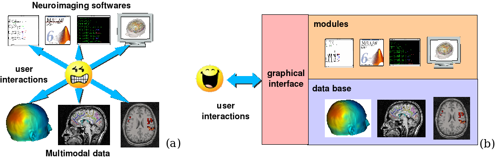

  *BrainVISA* management of software and data

  (a) Classical Software and data management without *BrainVISA*. Each user is responsible of all the interactions between programs and data.

  (b) *BrainVISA* organization. Programs and data are organized by *BrainVISA* and can be accessed through a unified user interface.

In the neuroscience domain, there is no standard way to organize and manage various programs and heterogenuous data. Therefore, this work is done at the user level (`figure 1a <fig_brainvisa_management_>`_). As a result, each institute, each group or even each person can have a personal unique organization stategy (when they have one). It is therefore very difficult to share data between people using different organizations. Moreover, it is often a hard work to use different programs on the same data because it is necessary to manage several incompatibilities (unit conversion, file format, 3D referential, etc...). This work has to be done for each data and it can be a fastidious repetitive task.

*BrainVISA* has been designed not only to provide an organization system for programs and data, but also to free users from all the technical work required to combine different programs and data. *BrainVISA* architecture organizes programs through a set of modules and data through a database system. A unifiying graphical interface is provided to access programs and data (`figure 1b <fig_brainvisa_management_>`_).

Who developped BrainVISA
------------------------

*BrainVISA* was developed by a group of methodologists at the *IFR 49* (Institut Fédératif de Recherche). Their aim was to provide for potential users a range of methodological tools, via a relatively user-friendly unifying interface. In addition, this interface facilitates communication between the different groups of methodologists working in the various laboratories. This project was financed by the french ministry of Research, within the framework of an ACI (Action Concertée Incitative) in the telemedicine field. The first prototype was
developed by Yann Cointepas in 2000/2001. See:

  *Y. Cointepas, J.-F. Mangin, L. Garnero, J.-B. Poline, and H. Benali. BrainVISA: Software platform for visualization and analysis of multi-modality brain data. In Proc. 7th HBM, Brighton, United Kingdom, pages S98, 2001*.

What is provided with the *BrainVISA* package
---------------------------------------------

*BrainVISA* is a software platform that provides access to various analysis tools and enables to run one or more sequences of processes on a series of images. These processes are called up from specific libraries, or via command lines provided by different laboratories. These command lines therefore act as building blocks, which are used to create the tools assembly lines. *BrainVISA* comes with a range of different modules, for use in anatomical image processing, morphometry.

Other tools are provided by Anatomist, such as image viewing commands (fusion, display of graphs, etc.). Anatomist is a visualization and manipulation software used with images and structured objects such as sulci graphs (http://brainvisa.info). BrainVISA interacts with Anatomist in the management of a certain number of processes. Modules pertaining to functional image analysis or EEG-MEG analysis have also been implemented and are distributed as an additional toolbox (http://cogimage.dsi.cnrs.fr/logiciels/index.htm). It is perfectly possible to integrate your own processes or modules. All you need is a basic knowledge of computing and programming (Python language).

Quick start
-----------

.. |browse_write| image:: images/browse_write.png
.. |database_read| image:: images/database_read.png
.. |database_write| image:: images/database_write.png
.. |eye| image:: images/eye.png

Here is a summary of the main steps that you need to follow to start with BrainVISA:

* **Create a database** where all data written by BrainVISA will be stored: *BrainVISA menu -> Preferences -> Databases -> Add button*. It is strongly advisable to use a database to process data with BrainVISA. Indeed, some important features are not available when you are using data outside a database. More information about databases in the :ref:`Databases and ontology <database>` chapter.

* **Import raw data**: *Data Management toolbox -> import...* Choose the process according to the type of data. Select raw data with |browse_write|. Fill in database attributes using |database_write|. The process will copy data in BrainVISA database.

* **Process data**: Open a process, enter input parameters by selecting them in the database using |database_read|. BrainVISA automatically complete as many parameters as possible. Output data will be written in the database.

* **Visualize data** with |eye|

* **Iteration** of a process on several data with the iterate button in the process.

.. _installation:

Installation
============

Checking your computer
----------------------

Before installing *BrainVISA* on your computer, you need to check a few things:

* Your operating system and its version
* 1.5 Gb of free space
* 2 Gb of RAM. However, it should be noted that this depends on the size of the images you work with. 1 Gb is the minimum recommended value, and you may run into problems when dealing with large data such as diffusion-weighted images or MRI. If you are planning to buy a computer, we advise you to get one with at least 8 Go Mb of RAM.

The operating system
--------------------

BrainVISA has been developed as a cross-platform software, and thus can run on Linux, Windows and MacOS. For a more precise description of OS releases that have been tested, please refer to the web site: :web:`http://brainvisa.info/download.html <download.html>`

It is possible that your operating system and version are not mentioned in the supported systems table there. When you install a package, you may encounter a number of different problems. You can either update your system or compile the sources. To compile the sources, please refer to `the downoad section <download_>`_.

Recommended hardware
--------------------

The video card often comes up in questions about recommended hardware. Here are a few pointers:

* If you work with linux, 3D graphics generally have two sets of 3D drivers: open-source, community drivers, and proprietary drivers written by the company who build the hardware. Proprietary drivers do normally work better and are more optimized. But some open-source drivers now are OK in many situations. As of 2014 we generally use open-source drivers for AMD hardware, and proprietary drivers for NVidia hardware.

* If you encounter graphic display problems, please refer to http://brainvisa.info/forum.

.. download:

Downloads
---------

You can download ready-to-install binary packages. If the binary distribution does not work (for example, if your operating system is not compatible), you can download the sources for compilation via your working environment (see http://brainvisa.info/repository.html#use_brainvisa_sources for compilation instructions).

You can download the packages via the following link:

:web:`http://brainvisa.info/downloadpage.html <downloadpage.html>`

Installation
------------

Installation instructions are provided with the download instructions.

Using programs
--------------

Several programs are available: two important main software (BrainVISA and Anatomist), along with many command lines for the processing tools (Aims, Vip etc). All the programs are independent of each other. They are in the ``bin`` subfolder of the binary package.

Program: BrainVISA
++++++++++++++++++

To use BrainVISA, run the ``brainVISA`` (``brainvisa.bat`` on Windows) file by double clicking it via either a shortcut on the desktop or the ``bin`` folder.

Refer to this :ref:`appendix <helpcom>` to see the *brainvisa* command options, or enter one of the following command lines:

::

  brainvisa -h

or:

::

  brainvisa --help

Program: Anatomist
++++++++++++++++++

The Anatomist application is independent of BrainVISA. You can run Anatomist without running BrainVISA. Anatomist will be described in another handbook.

To use Anatomist, run the ``anatomist`` (``anatomist.bat`` on Windows) file by double clicking it via either a shortcut on the desktop or the ``bin`` folder.

Command lines
+++++++++++++

You can also launch ``Aims*.exe``, ``Vip*.exe`` or ``si*.exe`` command lines, such as ``AimsFileInfo``, independently of BrainVISA and Anatomist. To get information on a command, enter:

::

  <command_name> -h

You will find all the commands in the ``bin`` sub-directory or on the Web page: :documentation:`commands index <index_commands.html>`.

These commands are usable from a DOS terminal from the ``bin`` sub-directory of the BrainVISA package.

On Windows
##########

For instance, to use ``AimsFileInfo`` command via DOS terminal, follow the instrucions below:

#. Initiate a DOS terminal via the *Program -> Accessories -> Command prompt* menu.
#. Locate in ``bin`` sub-directory of the brainvisa package, and run the setu script ``bv_env.bat``

  ::

    C:\<brainvisa_dir>\bin\bv_env.bat

#. Launch the command:

  ::

    AimsFileInfo -i D:\data\image.ima

On Unix (Linux/Mac)
###################

* **Possibility 1:** To launch a program, for example ``anatomist``, enter the absolute pathname for the program:

  ::

    ~/<brainvisa_dir>/bin/anatomist

* **Possibility 2:** Source the setups script ``bv_env.sh`` in a bash terminal:

  ::

    . ~/<brainvisa_dir>/bin/bv_env.sh

(if you are using the csh or tcsh shell in your terminal, there is also a ``bv_env.csh`` script)

Then all the programs are available in the *PATH*: ``anatomist``, ``brainvisa``, ``AimsFileInfo`` and all others:

::

  anatomist

.. note::

  environment variables are initialized from each program. If you launch this line:

  ::

    ~/<brainvisa_dir>/bin/AimfileInfo

  all variables will be initialised and you can use them from any directory.

Uninstalling programs
+++++++++++++++++++++

The installation of the BrainVISA package does not modify the configuration of your system (no DLLs added, no changes to the registry, etc.).

To uninstall the BrainVISA package, delete the following items:

* The BrainVISA package folder.
* The folders ``.brainvisa`` and ``.anatomist`` are created when the programs are started.

  These folders contain user information, configuration files, template files, etc. ``.brainvisa`` and ``.anatomist`` folders are created for each user.

  These folders must therefore be deleted if you are sure you want to get rid of all the settings.

  On Windows, they are found in the user directory  (``C:\Documents and Settings\user_name``.

  On Unix, they are in the home directory ``*$HOME\user_name``.

.. warning::

  Sometimes users store their BrainVISA databases in the BrainVISA package folder. This is dangerous however, as, when you update your package (and therefore delete the previous one) you will also delete your database. Therefore, avoid storing your database in the installation package.

*BrainVISA* User interface
==========================

This chapter describes the various windows that can be found in BrainVISA graphical user interface.

General user interface
----------------------

The general user interface is BrainVISA main window that shows up when starting BrainVISA. It consists of four parts (cf. the figure below):

* A menu (1)
* A window providing access to processes (2) including a toolboxes/bookmarks panel (2.a) and a processes list (2.b)
* A window providing documentation about the selected item (3)
* A search box to search a process by name (4)

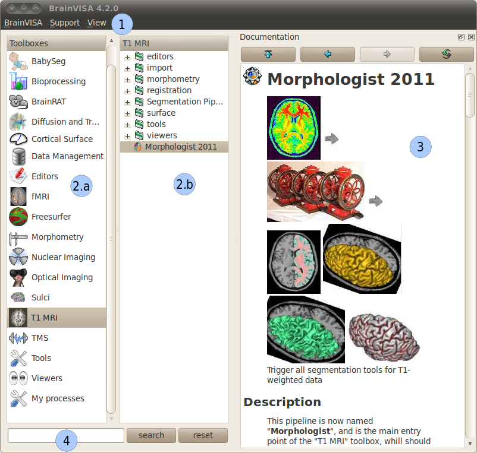

  General user interface of BrainVISA

BrainVISA menu
++++++++++++++

Main menu
#########

The *BrainVISA* menu gives you the following choices:

* *Help*: Opens the help page in a web browser, which provides access to a manual, a tutorial, etc.
* *About*: Opens a window that shows the version of BrainVISA and the institutes and laboratories that contributes to the project.
* *Preferences*: Opens the configuration window which is used to choose options and to configure BrainVISA databases.
* *Show log*: Opens a window providing information about the current session of BrainVISA: configuration, loaded processes, run processes, errors...
* *Open process*: Opens a process which have been previously saved in a ``.bvproc`` file.
* *Reload toolboxes*: Reloads toolboxes, processes, ontologies, databases. It is useful for people who develop their own toolboxes to take into account new files without having to quit and start again Brainvisa. Useful when developing new processes.
* *Start shell*: Opens in a console a IPython shell.
* *Quit*: Closes the application.

Support menu
############

The *Support* menu gives you the following choices:

* *Bug report*: Send a bug report, either with or without the log file.

When you click on *Bug report:*, a new window opens to send the email. Here are some details about the parameters of this window:

* *From*: mandatory, sender e-mail address, i.e. the user who sends the bug report.

* *To*: mandatory, destination address, i.e. the address to which the bug report is sent. The default destination address is: support@brainvisa.info.

* *Cc*: optional, to send a carbon copy to someone.

* *Bcc*: optional, to send a blind carbon copy to someone.

* *Attach log file*: use this option to attach the :ref:`log file <log>`.

* *Send*: to validate the sending of the e-mail.

* *Cancel*: to cancel the sending of the e-mail.

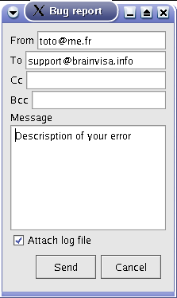

  Example of bug report

View menu
#########

The *View* menu can be used to hide/show optional panels in the main window:

* *Documentation*: Hides/Shows the documentation panel (3).

* *Workflow execution*: Shows/hides a panel that shows the workflows that have been run via Soma-workflow on available computing resources. This panel is hidden by default and the parallel computing features are available only if you select a Advanced or higher user level in BrainVISA preferences. See the :ref:`chapter about parallel computing with Soma-Workflow <soma-workflow>` for more information about this feature.

* *Close all viewers*: Closes all windows opened by Brainvisa viewers whichever way they have been run: through an eye button, directly running the viewer process, or using the contextual menu of the :ref:`Database browser <db_browser>`.

.. _toolboxes:

Toolboxes panel
+++++++++++++++

The left panel of the main window contains the list of available toolboxes. A toolbox contains a set of processes related to a common theme. When you select a toolbox, its list of processes appear on the next panel.

Several toolboxes are included in BrainVISA package but some other toolboxes are available for download separately and have to be installed in addition to BrainVISA main package. More information about existing toolboxes on :documentation:`http://brainvisa.info/toolboxes.html <toolboxes.html>`.

.. _bookmarks:

Custom toolboxes
################

It is possible to create a custom toolbox by adding your own processes in the ``.brainvisa/processes`` directory in your personal folder. If this directory contains processes, they will be available in BrainVISA interface in a toolbox named *My Processes*.

It is also possible to define new toolbox containing links to existing processes, it can a sort of bookmarks toolbox. It can be useful to group in such a toolbox the processes you mostly use.

To create such a toolbox, select *New* in the contextual menu. The name of the new toolbox is editable, type whatever you want. The name will be modifiable later by double-click on the toolbox. Then you can open the empty toolbox in another window via the contextual menu then drag and drop in it the processes you want to put as shortcut in this toolbox. The shortcuts can be moved, renamed and deleted in the personal toolbox. You can also create category directories to sort the shortcuts.

The custom toolboxes are automatically saved in a file ``.brainvisa/userProcessTrees.minf`` in your personal folder. They will be reloaded from this file next time you start BrainVISA.

Example of custom toolbox
#########################

On the image below, a toolbox My Processes is visible, it means that there are valid processes defined in .brainvisa/processes in the user's personal folder. A custom toolbox named Bookmarks is also visible : it contains shortcuts to processes from various toolboxes (T1 MRI, Tools, Data Management). New directories (tools, data) have been created and some shortcuts have been moved in it. The T1 MRI toolbox is opened in a new window : this enables to drag and drop items from this toolbox to the custom toolbox.

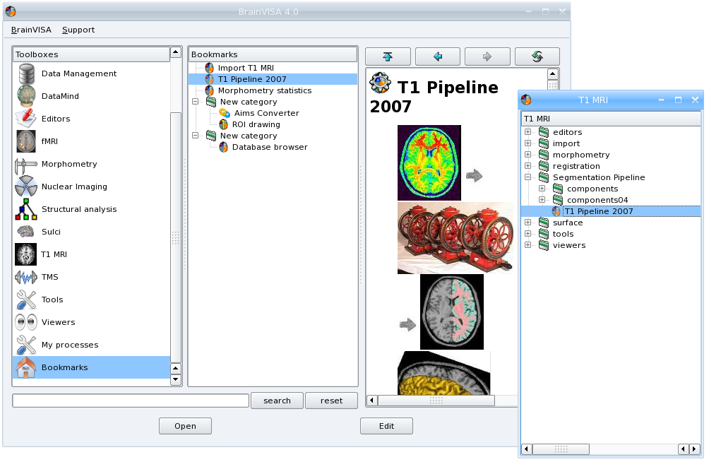

  Custom toolbox "Bookmarks"

Actions available in a custom toolbox
#####################################

A custom toolbox is editable, so several actions are available on the content of such a toolbox:

* **Renaming the toolbox**: Double-click on the name of the toolbox, type the new name and press enter key.
* **Adding a shortcut**: Drag an element of another toolbox and drop it in the custom toolbox.
* **Renaming a shortcut**: Double-click on the shortcut, type the new name and press enter key.
* **Moving a shortcut**: Drag and drop the shortcut at its new place.
* **Creating a new category directory**: Use contextual menu *New*.

Contextual menu
###############

The contextual menu available in toolboxes panel contains the following options:

* **New**: creates a new custom toolbox to store shortcuts to processes you often use.
* **Delete**: deletes the current selected toolbox if it is a custom toolbox. Of course, BrainVISA toolboxes cannot be removed.
* **Open**: Opens the current toolbox in a new window, this enables to drag and drop elements from one toolbox to another. However only custom toolboxes are editable, you cannot drop elements in a BrainVISA toolbox.
* **Set as default list**: Sets the current selected toolbox as the default toolbox, that is to say the toolbox that is selected at BrainVISA startup. Indeed, it is practical to have the toolbox you use most of the time already selected when BrainVISA starts.

.. _processes:

Processes panel
+++++++++++++++

The processes panel contains the list of available processes, which are organized into toolboxes and categories. The list of available processes changes according to the user level selected in the preferences. In basic level, some advanced processes are hidden. The user level of a process is shown on its icon. Remember that level 1 and level 2 processes are either for advanced users (level 1) or evaluation purposes (level 2, for which no help is available).

For example, the *T1 MRI -> import* category provides access to the  *Import T1 MRI* process. To open the process, either double click on the process name, or right-click on it and select *Open* in the contextual menu.

Contextual menu
###############

The contextual menu available in processes panel when you right click on a process item contains the following options:

* **Open**: Opens the process window in order to run it.
* **Edit documentation**: Opens the documentation edition window that enables to write the documentation of the process. This feature is useful for users who develop their own processes.
* **Iterate**: Opens the iteration dialog window in order to run this process on a set of data. It is equivalent to clicking on the *Iterate* button in the process window.

There is no contextual menu available for categories directories.

.. _documentation:

Documentation panel
-------------------

This panel displays information to help you using BrainVISA in general, or a specific process. When BrainVISA is opened, this window automatically displays the main BrainVISA help page. When a process is selected, the related documentation is shown.

This panel is now a dock window so it can be hidden using the menu *View -> Documentation* or by clicking on the close button (cross) at the top right corner of the panel. It is also possible to get this panel out of the main window by clicking on the float button (squares) at the top right corner of the panel.

Editing process documentation
+++++++++++++++++++++++++++++

It is possible to edit and modify the documentation of your processes in BrainVISA interface. Click on the edit button or select Edit in the contextual menu of the process. The following window appears:

.. figure:: images/process_doc_edit.png
  :align: center

  Process documentation edition window

See the :axondev:`Process documentation <developer_manual.html#documentation>` in BrainVISA Programming manual for more information about this documentation edition interface.

BrainVISA user interface icons
------------------------------

Description of BrainVISA user interface icons:

.. raw:: html

  <table class="docutils">
    <thead>
      <tr class="row-odd">
        <th> Icon</th>
        <th> Description</th>
      </tr>
    </thead>

    <tbody>

      <tr class="row-even">
        <td></td>
        <td> This button takes you back to the first documentation page of BrainVISA, i.e. to the main BrainVISA help page.</td>
      </tr>
      <tr class="row-odd">
        <td></td>
        <td> This button takes you back to the previous documentation page. </td>
      </tr>
      <tr class="row-even">
        <td></td>
        <td> This button takes you to the next documentation page (and, in iterative mode, it also indicates the process that is currently underway).</td>
      </tr>
      <tr class="row-odd">
        <td></td>
        <td> This button reloads the current documentation page. </td>
      </tr>

      <tr class="row-even">
        <td></td>
        <td> This icon represents user level 0 processes. Basic processes accessible to all users.</td>
      </tr>

      <tr class="row-odd">
        <td></td>
        <td> This icon represents user level 1 processes. Advanced processes accessible to advanced users. </td>
      </tr>

      <tr class="row-even">
        <td></td>
        <td> This icon represents user level 2 processes. Expert processes accessible to expert users. In fact, these processes
        consist of internal  BrainVISA processes (started up via level 0 or level 1 processes) or processes that are still being developed
        and do not, therefore, give reliable results.</td>
      </tr>
      <tr class="row-odd">
        <td></td>
        <td> This icon represents a viewer, that is to say a process dedicated to the visualization of certain type of data. This type of processes is automatically run when you click on the eye button next a parameter data in a process.</td>
      </tr>
      <tr class="row-even">
        <td></td>
        <td> This icon represents an editor, that is to say a process dedicated to edition of certain type of data, for example the manual correction of a mask. This type of processes is automatically run when you click on the editor button next a parameter data in a process.</td>
      </tr>

    </tbody>
  </table>

.. _pref:

Preferences window
------------------

The *Preferences* menu allows to customize user settings in several aspects of BrainVISA. Depending on the installed toolboxes, the preferences window may show a variable number of items. It is not necessary to complete all the fields to use BrainVISA, however they do allow you to optimally configure your user profile. The mandatory fields, such as *user level* or *language* contain a default value. Some fields become mandatory when you want to use processes that start up external programs such as Matlab (*matlabExecutable* field).

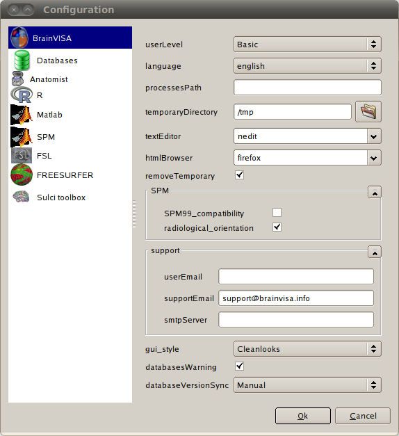

  Preferences window

.. _optg:

Configuring the main options
++++++++++++++++++++++++++++

The general *BrainVISA* sub-panel is used to configure several options for customizing your BrainVISA platform (see figure above).

General parameters
##################

* *userLevel*: this field can contain any one of 3 values: *Basic* for a standard user (access to top-level processes) or *Advanced*/*Expert* for more experienced users (access to lower level processes or processes undergoing validation/implementation).

* *language*: this field can contain any one of 3 values: *System default* which is the default language in your operating system, *English* or *French*.

* *textEditor* is the external editor program used to show or edit text files when needed. It is used by several viewer or editor processes.

* *HTMLBrowser*: list of browsers available on your workstation. you can specify the browser you wish to use.

The following parameters are for an advanced use of BrainVISA:

* *processesPath*: this optional field is used to configure the path to BrainVISA processes program files. It is for experienced users.

* *temporaryDirectory*: parameter is used to configure a path to temporary files.

* *removeTemporary* determines if temporary files created within BrainVISA should be deleted immediately to free disk space, or only when exiting BrainVISA. Such deletion delay is useful for processes developers when debugging processes.

* *gui_style* enables choosing the preferred style for the graphical interface.

* *databasesWarning*: unselect this option to disable the warning that is shown at startup when you have not created any database.

* *databaseVersionSync*: Management of the database synchronization through BrainVISA versions. Possible options are:

  * Ask User: BrainVISA will ask what to do when a database need to be updated.
  * Automatic: BrainVISA will automatically update your database if you switch from one BrainVISA version to another.
  * Manual: If you modify a database and then switch from one BrainVISA version to another, you will have to update the database if you want BrainVISA take into account the modifications.

SPM parameters
##############

* *SPM99_compatibility* tells AIMS applications and Anatomist if it should read/write SPM/Analyze format images like SPM99 did, or rather like SPM2 does. See AIMS and SPM documentations for more details.

* *radiological_orientation*: for SPM format images, tells wheter they are considered to be in radiological (right to left) or neurological (left to right) convention when no further information is available in the image files.

Support parameters
##################

The *Support* settings section is used to configure the automatic electronic mail system for sending bug reports. This configuration is only relevant if you have access to the internet, and if you are familiar with all the mail transfer parameters. If in doubt, contact your network administrator.

* *userEmail*: e-mail address of the sender, i.e. the user who sends the bug report.

* *supportEmail*: destination, i.e. the address to which the bug report is sent. The default destination address is: support@brainvisa.info

* *SMTP_server_name*: address/name of the server that manages the SMTP (Simple Mail Transfer Protocol).

.. _configdb:

Databases
+++++++++

Databases configuration panel
#############################

The *Databases* configuration item is used to configure one or more databases. Each database is associated with a directory and a database organization description (ontology).

The database configuration window provides several functions (cf. figure below):

* *Edit*: Provides access to the parameters of a database, and allows the user to modify them.
* *Add*: Used to configure a new database.
* *Remove*: This removes the database entry in BrainVISA, but does not delete the database file and directory (no data is lost).

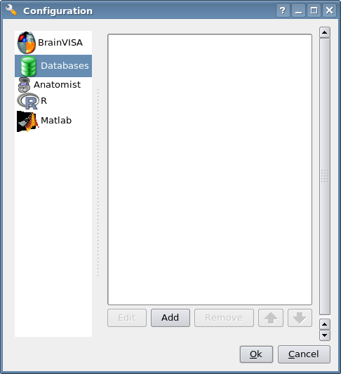

  *Databases* configuration panel

Creating a database
...................

We are now going to create a database. Please follow the instructions below:

#. Open the *Preferences* window and select the *Databases* item.

#. Click the *Add* button.

  .. figure:: images/database_2.png
    :align: center

    Adding a database

3. Complete the following fields (only *directory* is mandatory):

  * **directory**: mandatory field. Enter the path of the folder that will contain your database.
  * Expert settings

    * **ontology**: The ontology describes the database organization. The default organization, *brainvisa-3.2.0*, should be OK for most usage. However, custom organizations may be defined and used.
    * **sqliteFileName**: The database indexation is stored in a SQLite file. With this option, it is possible to choose the name of this file.
    * **activate_history**: When this option is checked history information will be recorded in the database directory: the log of the processes and brainvisa session which have been run to write data in the specified database. It is possible to view the history of data thanks to the :ref:`Database browser <db_browser>`.

  .. figure:: images/database_3.png
      :align: center

      Creating a database

4. Click *Ok* when you have finished entering your parameters.

  .. figure:: images/database_4.png
    :align: center

    List of database

Anatomist configuration panel
+++++++++++++++++++++++++++++

* *executable*: this parameter is used to configure the command for starting up Anatomist.

R panel
+++++++

* *executable*: command used for starting up the R program.
* *options*: R software options passed to the R commandline.

Matlab panel
++++++++++++

* *executable*: this parameter is used to configure the command for starting up MatLab.
* *version*: Matlab release version, used to assume a specific version and avoid the automatic detection which may take a few seconds.
* *options*: used to configure options for MatLab.
* *path*: used to configure the path from which matlab files will be loaded.
* *startup*: run this matlab command when starting up matlab.

SPM panel
+++++++++

It is possible to set the paths to 3 versions of SPM: SPM 5, SPM 8 (Matlab) and SPM 8 standalone.

* *spm8_path*: Path to SPM 8 installation (Matlab version)
* *spm8_standalone_command*: Location of the standalone version of SPM 8 run command (``run_spm8.sh`` on linux).
* *spm8_standalone_mcr_path*: Path to the Matlab Compiler Runtime (MCR) needed for a standalone version of SPM 8.
* *spm8_standalone_path*: Path to SPM 8 files (where the templates for example are installed) in the standalone version.
* *spm5_path*: Path to SPM 5 installation (Matlab version).

An *Auto detect* button is available at the bottom of the panel. It enables to try and find the spm paths automatically. Only one the 3 versions is needed to use the processes that need SPM (SPM normalization in Morphologist for example).

FSL panel
+++++++++

* *fsl_commands_prefix*: Needed if the fsl commands in your installation starts with a prefix, for example ``fsl4.1-flirt``.

Freesurfer panel
++++++++++++++++

* *freesurfer_home_path*: Location of Freesurfer installation directory.
* *subjects_dir_path*: Value of ``SUBJECTS_DIR`` variable.

Sulci toolbox panel
+++++++++++++++++++

* *check_spam_models*: Enable or Disable the checking of SPAM identification models installation for the automatic recognition of sulci.

User configuration
++++++++++++++++++

When configuration is done, the configuration data is stored in the user ``.brainvisa`` folder. There are actually two profile types: a general one (``options.minf``) and named profiles that can be used to store or use alternative configurations (``options-<userprofile>.minf``).

These different profiles are particularly useful when you must use a shared user connection.

Locating configuration files
############################

If your user name is ``user``, for instance the general configuration file will be placed in:

* **Unix / MacOS:** ``$(HOME)/.brainvisa/options.minf``, typically ``/home/user/.brainvisa/options.minf``
* **Windows:** generally something like ``C:\Documents and Settings\user\.brainvisa\options.minf``

Customized configuration files for named profiles are placed in the same directory.

The general profile is automatically used when BrainVISA is launched.

Using / configuring a specific profile
######################################

To use and configure a specific profile, for example toto, follow the instructions below:

#. Start BrainVISA with a profile name (even if it does not exist yet), for instance

  ::

    brainvisa -u toto

2. Customize this profile with the configuration interface: *Preferences* menu.

#. Validate them with the *OK* button

#. Exit BrainVISA.

#. To start BrainVISA with this profile:

  ::

    brainvisa -u toto

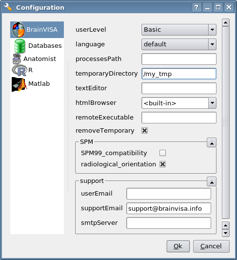

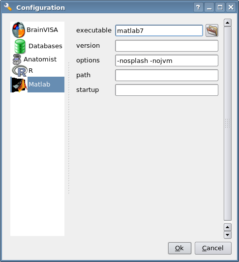

  Example of a Linux configuration : here we have changed the *temporaryDirectory* and *Matlab executable* fields.

.. _log:

BrainVISA *log* window
----------------------

The log window enables the user to monitor all the actions performed by BrainVISA. It shows information about the configuration, the processes that have been run during and their parameters, the errors that occured during the session.

The information displayed in this window is stored in a file which you should therefore keep if you wish to submit an execution error to the BrainVISA support. In many cases, if this file is not available, the information submitted is not specific enough to enable the error to be understood or reproduced.

The *log* window can be accessed via the *BrainVISA -> Show Log* menu. If you open it just after starting the session (i.e. before running a process) you can see the list of read processes, and check if they were loaded successfully. If a dependency of a process is not installed on your workstation, the process cannot be loaded and a warning is displayed in the log window. Here is an example of the log interface:

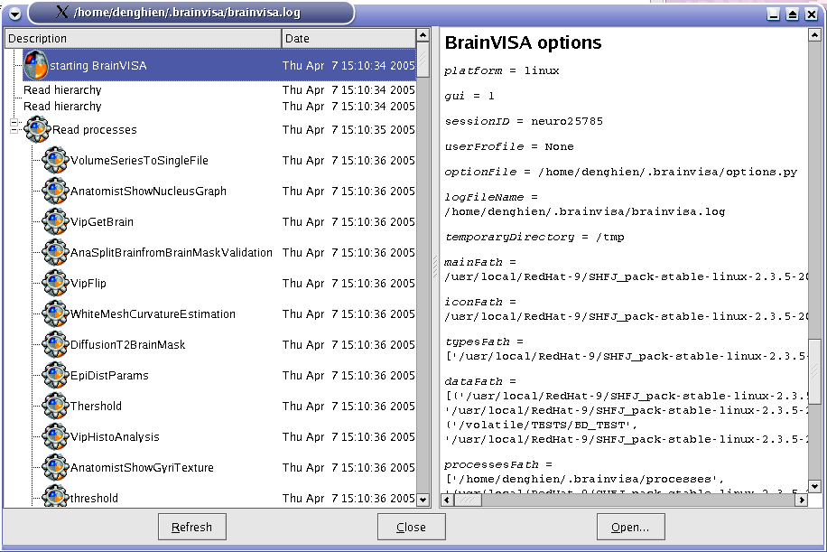

  *Log* interface.

Description of BrainVISA log user interface:

.. raw:: html

  <table class="docutils">
    <thead>
      <tr class="row-odd">
        <th> Icon</th>
        <th> Description</th>
      </tr>
    </thead>
    <tbody>
      <tr class="row-even">
        <td></td>
        <td> This icon represents a BrainVISA process run. </td>
      </tr>
      <tr class="row-odd">
        <td></td>
        <td> Icon in the log interface, denoting communication with Anatomist.</td>
      </tr>
      <tr class="row-even">
        <td></td>
        <td> Icon in the log file, representing a warning.  When BrainVISA is loaded, all the processes are analyzed to make sure that all
        the external programs required to run them are available. If not, the process is not loaded, and a warning is displayed in the log
        interface. For example, if you wish to use a process that requires Matlab, and Matlab is not installed on your system or your object
        program path is not properly configured, a warning will be displayed.</td>
      </tr>
      <tr class="row-odd">
        <td></td>
        <td> This icon represents a system command call.</td>
      </tr>
      <tr class="row-even">
        <td></td>
        <td> This icon represents an error.</td>
      </tr>
    </tbody>
  </table>

Example of *log* window
+++++++++++++++++++++++

You can see this windows at any time. In the example below, we can see the list of processes run, and the associated parameter values and output. Here, we are looking at the *Import T1 MRI* process, but we can also see that the *Anatomist Show Volume* process has been run, and view the communication between BrainVISA and Anatomist via |anat|.

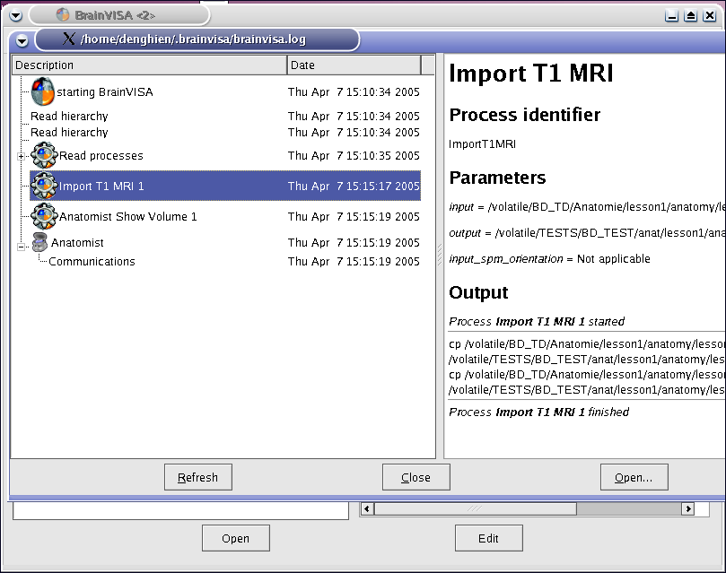

  Viewing the execution of a process via the  *log* interface.

Saving the *log* file
+++++++++++++++++++++

The *log* file is re-edited each time a new session is opened. So, if you want to save it, you must do so before opening a new session, otherwise the data will be lost.

To save the *log* file, follow the instructions below:

* Exit BrainVISA (and don't start it up again until you have saved the *log* file).
* In Linux, go to the following folder:

  ::

    /home/user/.brainvisa

* In Windows, go to the following folder:

  ::

    C:\Documents and Settings\user\.brainvisa\

* Save the ``brainvisa.log`` file of this folder.

.. note::

  If you started up BrainVISA with a specific profile, say, ``toto`` (and there is therefore a specific ``options-toto.py`` configuration file), you should save the ``brainvisa-toto.log`` file.

.. note::

  You should not save it during a BrainVISA session otherwise the log file will not be readable.

.. note::

  You may have several log files with numbers (eg. ``brainvisa2.log``). It can occur when several instances of BrainVISA have been running at the same time or if a BrainVISA session didn't terminate correctly. To know which log file is associated to the current session, you can have a look at the console messages at BrainVISA starting, it says the name of the log file. The log interface also displays the name of the log file in the title of the window.

Errors window
-------------

When you work with BrainVISA, sometimes you obtain an error screen. The error window contains a list of error messages. You can click on the button *More info* to see the complete traceback of the errors.

In the example below, the error indicates that a mandatory parameter of the process has not been filled in before running the process.

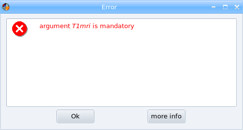

  Error screen

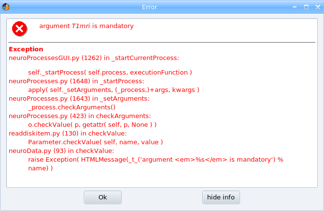

  Error screen after a click on More info

Viewing errors
++++++++++++++

Even if you close the error screen, the errors are still available for consultation in BrainVISA *Log* file. See the paragraph on the :ref:`log window <log>`.

What to do in the event of an error
+++++++++++++++++++++++++++++++++++

Here is a little advice on what to do if an error occurs while a process is running:

* Make sure that the error is not related to the management of the database or the type of data selected (wrong type of data, inexisting data, etc.).

* Consult the process log via the *BrainVISA -> Show log* menu (for more information, see the paragraph on the :ref:`log window <log>`).

* Sign up to and consult the forum at http://brainvisa.info/forum.

* Report the error to the BrainVISA team on the forum and attach the log file to your post.

User interface of a process
---------------------------

Presentation
++++++++++++

The graphical interface of the processes is generally automatically generated, that's why this interface is very similar from one process to the other. We shall call the values that the user must enter to run a process "parameters". There are mandatory parameters (shown in bold type) and optional parameters. The parameters are entered in various ways: selection of a file or a list item, entry of a value, etc.

The table below describes process interface icons:

.. raw:: html

  <table class="docutils">
    <thead>
      <tr class="row-odd">
        <th> Icon</th>
        <th> Description</th>
      </tr>
    </thead>
    <tbody>
      <tr class="row-even">
        <td></td>
        <td> This icon allows you to open a dialog window and select several values.</td>
      </tr>
      <tr class="row-odd">
        <td></td>
        <td> This icon provides access to your files. It enables you to select an input or output file without using the BrainVISA database system.</td>
      </tr>
      <tr class="row-even">
        <td></td>
        <td> This icon represents an input parameter. It provides access to existing data stored in a BrainVISA database. It shows all the data corresponding to the parameter type and allows selection by attribute value.</td>
      </tr>
      <tr class="row-odd">
        <td></td>
        <td> This icon represents an output parameter. It provides access to existing or non existing data in a BrainVISA database. It shows all the data corresponding to the parameter type and allows selection by attribute value.</td>
      </tr>
      <tr class="row-even">
      <td></td>
        <td> This icon represents a link with Anatomist. It is mainly used for parameters that are, in fact, 3D points. When this icon is clicked,
        the current location of the 3D cursor (i.e. the red cross) in Anatomist is taken as the parameter value. It allows the user to select a value by clicking it in Anatomist.</td>
      </tr>
      <tr class="row-odd">
        <td></td>
        <td> This icon tells you whether a data item can be visualized or not. If the button is enabled it means that BrainVISA has a viewer capable of displaying that type of data. If the icon is disabled (i.e. not clickable), it means that the corresponding file is not readable (usually because the file does not exist). If this button is not displayed, it means that BrainVISA doesn't have any viewer for this type of data.</td>
      </tr>
      <tr class="row-even">
        <td></td>
        <td> This icon provides access an editor to manually correct data. For instance, the editor for label volume is ROIs toolbox in Anatomist.</td>
      </tr>
      <tr class="row-odd">
        <td></td>
        <td> This icon appears next to a parameter name to indicate that this parameter has been modified, it doesn't have its default value anymore.</td>
      </tr>
      <tr class="row-even">
        <td></td>
        <td>This icon indicates if the data is locked. Only output files are concerned (files with &database_write;). It is not possible to execute a process when it has a locked file in its output parameters.</td>
      </tr>
      <tr class="row-odd">
        <td></td>
        <td> This icon indicates that a step has finished correctly in an iteration or a pipeline.</td>
      </tr>
      <tr class="row-even">
      <td></td>
      <td> This icon indicates that an error has occurred during a step of an iteration or a pipeline.</td>
      </tr>
    </tbody>
  </table>

.. _parameter_menu:

Menu of a parameter
+++++++++++++++++++

By right-click on a parameter, one or two options are available:

* **default value**:
Always available. Some parameters have a **default value** (not null) and so there are already filled in when you open the process. Other parameters are automatically filled in by BrainVISA when you fill in another parameter. Indeed, it is possible to define links between parameters in a process to indicate that the value of one parameter can be guessed from the value of another parameter. A lot of processes use this feature to speed up the parameters capture.

* **lock**: This option is available if the data is an output file and if the file exists. So that, the parameter can be locked. In fact, sometimes you would like to preserve the output file because you set/changed specific options. Once a file is locked, then a process can't rewrite this parameter. A message will be displayed to indicate that you must unlock data if you want to run the process. To unlock a parameter, just click on the *lock* option in the menu to unselect this option. When a parameter is locked, a ``<filename>.lock`` file is created. There is no link with the database or ``.minf`` file.

Example of a process interface
++++++++++++++++++++++++++++++

We will take the following process as an example: *Prepare subject for anatomical pipeline*. This process is located in *Morphologist -> Segmentation Pipeline -> components*. It enables to locate the following points in a brain image: the posterior commissure (PC), the anterior commissure (AC), an interhemispheric point (IP) and a point on the left hemisphere. In fact, these reference points must be located before running the *Morphologist* pipeline (when not using normalization) to determine whether or not the orientation is correct (axial, coronal, sagittal and radiologic convention) and to compute a common referential.

.. note::

  To do this example, first you must import data if you want to use a database as explained in :ref:`Data importation <importt1>` paragraph.

Parameters are:

* *T1mri*: Selecting the T1 weighted MRI, either using |database_read| (selection from your database of imported images), or via |browse_write| (selection from all the files on your disk).

* *Commissure_coordinates*: selecting the output file. This field is automatically completed when you select a T1 weighted image using |database_read|. Otherwise, you must select the output file with |browse_write|.

* *Normalized*: you need to know if your image has already been normalized. If it has, choose the procedure used to normalize it, and the AC, PC and IP will not have to be selected from an anatomical volume. You will however have to run the process so that the type of normalization is taken into account and .APC file is created. On the other hand, if your volume has not been normalized, you will have to select the AC, PC and IP from the anatomical volume proposed by Anatomist.

* *Anterior_Commissure*: click |anat| to access your anatomical image via |anat| and to select the coordinates. When you click the first time, a new Anatomist session is opened. Then, if the cursor is correctly located on the volume, click again to display the coordinates in the field.

* *Posterior_Commissure*: cf. *Anterior_Commissure*

* *Interhemispheric_Point*: cf. *Anterior_Commissure*

* *Left_Hemisphere_Point*: cf. *Anterior_Commissure*

* *Allow_flip_initial_MRI*: two values are listed, *True* or *False*. This option authorizes or forbids the user to rewrite the volume so that the orientations (axial, coronal and sagittal) and the convention (radiological) are correct.

After running the process, you will be able to view the ``.APC`` file by clicking the |eye| in *Commissure_coordinates*.

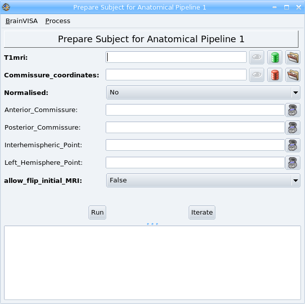

  Process interface:  *prepare subject for anatomical pipeline*

Running and interrupting a process
++++++++++++++++++++++++++++++++++

When you have completed all the fields required by the process (all fields in bold), you can launch the process by clicking the *Run* button halfway up the left-hand side of the process window. You can then watch the progress of the process in the lower half of the process window. You will be told explicitly when the process starts and ends. While the process is running, the following icon (in the top right and corner) will be constantly animated. The duration of a process varies according to the algorithms used by the process and performances of your workstation. In fact, a process such as a conversion is almost instantaneous, whereas some heavy processing ones may take several hours depending on your workstation.

.. figure:: images/rotatingBrainVISA.gif
  :align: center

  Icon animated during a process run.

When the process begins, the *Run* button is replaced by an *Interrupt* button, which enables to stop the process when needed.

Save the state of a process
+++++++++++++++++++++++++++

It is possible to save the state of a process (input and output parameters) in a file in order to reload it later. To do so, click on the *Process -> Save* menu and choose the place and name of the file which will store the state of the process. The file will have the extension ``.bvproc``.

To reload a saved process, use the *BrainVISA -> Open process* menu and select the ``.bvproc`` file previously saved.

.. _pipeline:

User interface of a pipeline
----------------------------

A pipeline is a special process that is composed of several other processes. A pipeline can chain a series of processes and offer a choice between different methods, each implemented in a different process. A pipeline can also contain other pipelines, so it can be a tree of processes.

This type of proceses have a special user interface that shows the composition of the pipeline and enables to choose between several methods and to unselect some optional steps.

In the example below, the structure of the pipeline is visible in the left part of the process window. When you select a step, you can see in the right part the parameters of the current step (process). A check box next the name of the step indicates that it is optional, you can click on the box to modify the selection. A radio button next the name of the step indicates that it is one of several choices, if you select one, the others are automatically deselected. Only the checked steps will be executed when the pipeline is started.

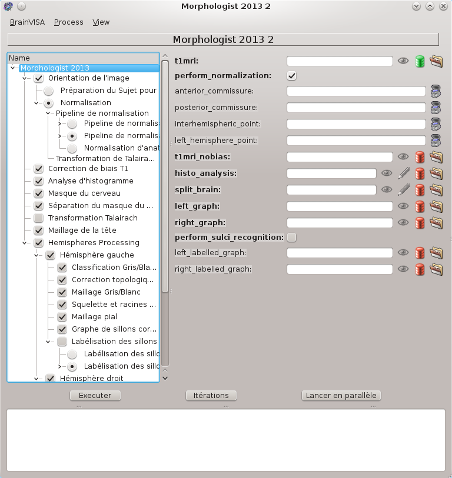

  Example: the Morphologist T1 segmentation pipeline.

A contextual menu (right click) offers several features to ease the selection/deselection of the steps, to open a step in a new window or to show its documentation. Here are the different options of this menu:

* **Unselect before**: Unselect all the steps before the current step at the same depth level.
* **Unselect after**: Unselect all the steps after the current step at the same depth level.
* **Select before**: Select all the steps before the current step at the same depth level.
* **Select after**: Select all the steps after the current step at the same depth level.
* **Unselect steps writing lock files**: Unselect the steps that have a locked file as output parameter. More information about locked files :ref:`here <parameter_menu>`.
* **Unselect steps upstream of locked files**: Unselect the steps that have a locked file as output parameter and the steps before.
* **Open this step separately**: Open the process window of the current step.
* **Show documentation**: show the documentation of the current step in the BrainVISA documentation panel.

.. _iteration:

User interface of an iteration
------------------------------

The iterative mode enables you to sequentially run the same process on several input data. This is very similar to a batch mode, with a user-friendly interface. This means that, for each input file selected, you can adjust the parameters as required. For example, if you are converting several  *DICOM* volumes, some can be converted to *GIS* format (``.ima`` and ``.dim``), and others can be converted to *NIFTI* format (``.nii``). This is a very convenient mode as it makes it possible to repeat the same process using different parameters (or not), on a group of input files. For instance, you can apply exactly the same process to all the brain images in a given protocol.

* To use the iterative mode, follow the instructions below:

#. Open the process or if you do not need to change a parameter for all processes, you can use the contextual menu *Iterate* and go directly to step 4.

#. If necessary, modify a parameter, which will remain the same for all the repeated processes.

#. Press the *Iterate* button on the bottom right. A new window opens.

#. In the new window, select the input files with |database_read| or |browse_write|. When you select the files in the filesystem with |browse_write| an additionnal interface appears enabling to select the files in several steps wich is useful when the files are in different directories. This list editor is also available from the |database_read| icon through a right-click on the button. The list editor also enables to add, remove items and change their order in the list.

#. If necessary, modify the process parameters of each iteration using  |point|. Note that the number of iterations with a given parameter should be equal to the number of input files. But if you set only one value, BrainVISA will use this value for all iterations.

#. Once the input files and the parameters have been configured, press *Ok*.

#. A new window appears, it is a pipeline composed of *n* iterations of the process. Via this new interface, you can view each process individually. You can also check or modify parameters.

#. You can deselect processes if you do not want them to be run. See the paragraph about :ref:`pipelines user interface <pipeline>` for more details about the possible actions.

#. All you have to do now is press *Run* to run all the processes. You can monitor the sequence of processes in the bottom part of the window. If an error occurs during a process, the iterative mode will go on to the next process.

.. note::

  If Soma-workflow is available in your version of Brainvisa, a new button *Run in parallel* may be available. This feature enables to execute the processes of the iteration faster than before using available computing resources. More information about this feature in the chapter :ref:`Parallel computing with Soma-Workflow <soma-workflow>`.

Parameter values
++++++++++++++++

Parameters can be modified at 3 levels:

* Via the general interface of the process that you wish to iterate: this modification will then be applied to each instances.

* Via the iteration dialog: use |point|. As mentioned above, the number of iterations for a parameter must be equal to the number of input files, if you select only one value, this value will be used for each instances. Each parameter value will be applied to the process, depending on the input files order.

* Via the iteration process window: you can modify the process parameters individually. The modification will only be applied to the current process.

Example: converting several files
+++++++++++++++++++++++++++++++++

In this example, we wish to convert 6 *GIS* images (``.ima`` and ``.dim``) in a database to *NIFTI* format (``.nii``).

#. Select the conversion process: *Tools -> converters -> Aims Converter*.
#. Select the *preferredFormat* parameter (*NIFTI-1 image*).

  .. figure:: images/iter_1.png
    :align: center

    Window 1: Process to be iterated

3. Start up the iterative mode by clicking *Iterate* button.
#. A new window is displayed:

  .. figure:: images/iter_2.png
    :align: center

    Window 2: Iteration dialog

5. Select the volumes on which you want to run the process by clicking |database_read|. A database file selector is displayed. Select  6 Raw T1 MRI (filter on the type). To select several files, use the *Ctrl* + *left click* combination.

  .. figure:: images/iter_3.png
    :align: center

    Window 3: Selecting files to iterate

6. Click the *Ok* buttons in windows 3 and 2. A new window, containing all the processes appears.

  .. figure:: images/iter_4.png
    :align: center

    Window 4: Iteration window

7. If needed, you can still modify the process parameters if necessary.
#. To start the iteration, click  *Run*
#. When the iteration is finished, the following window is displayed:

  .. figure:: images/iter_5.png
    :align: center

    Window 5: Iteration completed

Selecting a different value for each iteration
##############################################

To select the value of a parameter in relation to the input values (i.e. value of *preferredFormat* in relation to value of *read*), you can proceed this way:

#. After the fifth step, click on the *Ok* button to return to window 2:

  .. figure:: images/iter_note0.png
    :align: center

    Window 3.1 : After selection of *read* parameters

2. Click on |point| of *preferredFormat* parameter

  .. figure:: images/iter_note1.png
    :align: center

    Window 3.2 : Selection of *preferredFormat* parameters

3. Select the nth *preferredFormat* parameter in relation to nth *read* parameter with the menu:

  .. figure:: images/iter_note2.png
    :align: center

    Window 3.3 : Selection of *preferredFormat* parameter

  .. figure:: images/iter_note3.png
    :align: center

    Window 3.4 : Selection of *preferredFormat* parameter

4. Click on *Add* (this selection of *preferredFormat* parameter corresponds to the first *read* parameter):

  .. figure:: images/iter_note3bis.png
    :align: center

    Window 3.5 : Validation of the first *preferredFormat* parameter

5. Do the same to select the value of the parameter in each iterations.

#. Click on the *Ok* button in window 3.5 to return to the 6th steps:

  .. figure:: images/iter_note4.png
    :align: center

    Window 3.6 : *preferredFormat* parameters selection

7. Click on the *Ok* button in window 3.6 to return to step 6

:doc:`Axon manual (2) <axon_manual2>`
=====================================

The manual is continued :doc:`in the next section <axon_manual2>`.

