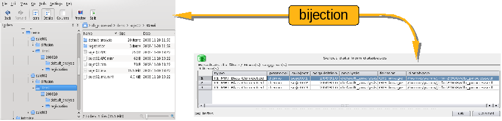
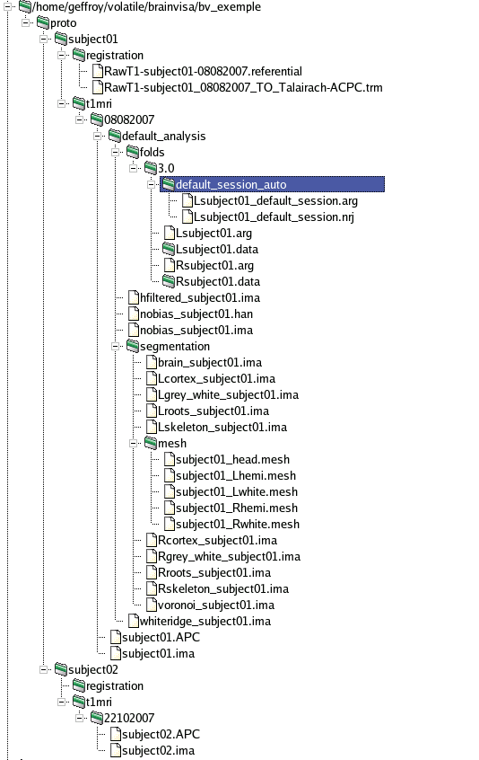
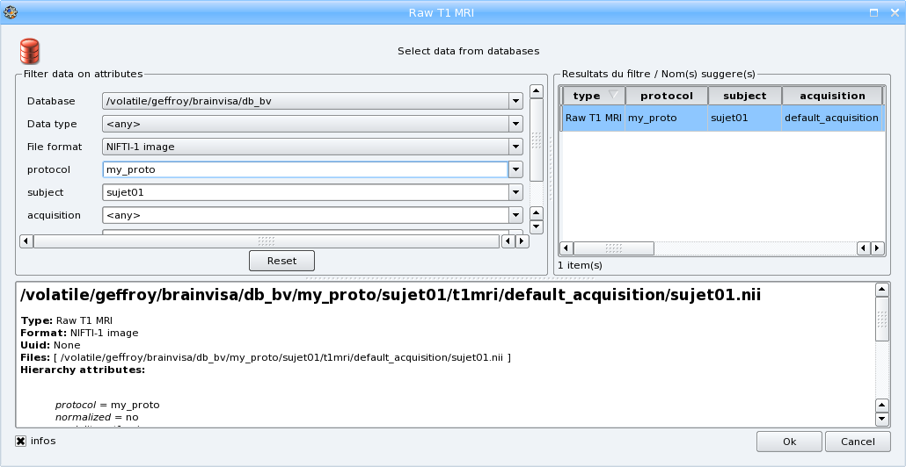
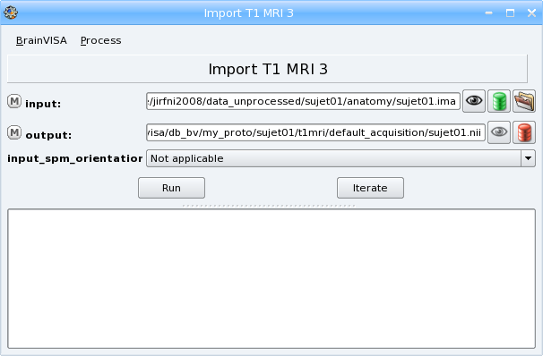
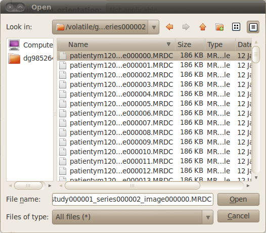
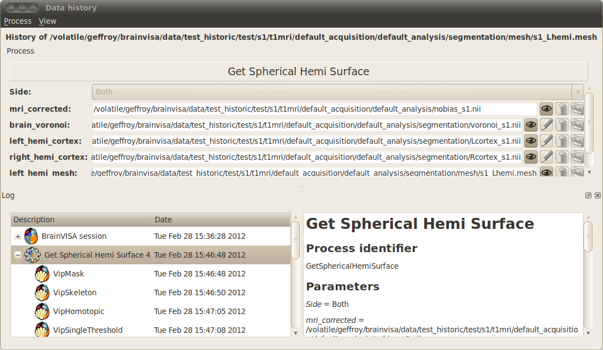
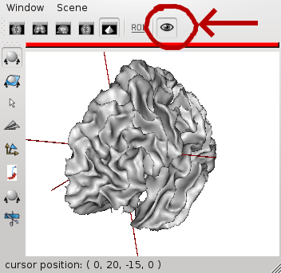
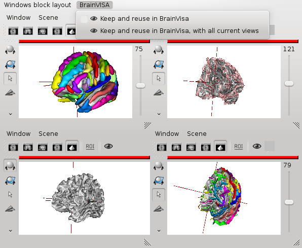

.. _database:

Databases and ontologies
========================

.. |browse_write| image:: images/browse_write.png
.. |database_write| image:: images/database_write.png
.. |unknown| image:: images/unknown.png

.. |icon_process_0| image:: images/icon_process_0.png
  :width: 24

Data organization is an important factor in understanding and using BrainVISA. In fact, BrainVISA was designed to simplify the use of the different neuroimaging tools developed by laboratories, and to combine data acquired by different methods (aMRI, fMRI, dMRI, EEG/MEG, PET, etc.). These different tools and methods are compatible, thanks to a data management system. In order to remain compatible with existing software, BrainVISA is mainly based on directories and file organization and naming to build a database.

Why using BrainVISA databases ?
-------------------------------

BrainVISA data management system offers a lot of advantages because it defines a shared data organization. It enables to:

* Reuse data from people who left the lab
* Share data with people from other labs
* Make links between data and so automatize data search
* Automatize the processing of a set of data

It is not really mandatory to use a database to process data with BrainVISA but it highly advisable. Indeed, some important features are not available when you are using data which are not in a database. For example, the BrainVISA ability to construct a default output file name when an input data is selected in a process relies on the database system. Moreover, some processes use the database system to find data. For example, the brain mask viewer tries to find the T1 MRI used to build the brain mask in order to superimpose both images in an Anatomist window.

What is a BrainVISA database ?
------------------------------

A BrainVISA database is composed of two parts:

* A directory containing data files that are organized in a hierarchy that follows BrainVISA ontology.
* A relational database built from the ontology and allowing to make efficient selection requests on data files according to their attributes. For example: get all the Raw T1 MRI acquired in a given protocol

So there are two ways of seeing the same data connected together by a common ontology.

  Correspondence between database directory and BrainVISA relational database

BrainVISA database stores the following information about data:

* **Data type**: identify the content of the data (image, mesh, functional image, anatomical MRI, etc). The data types are organized in a hierarchy making it possible to decline a generic type in several specialized types. For example, there is a *4D Image* type which is specialized in *3D Image* (indeed, a three-dimensional image is a particular case of a four-dimensional one); the type *3D Image* is itself declined in several types, for example *T1 MRI* and *Brain mask*.

* **File format**: Represents the format of files used to record a data (generally indicated by the file extension). BrainVISA is able to recognize several file formats (for example *Nifti*, *GIS*, *Analyze*, etc). It is possible to add new data formats and to provide converters to make it possible for existing processes to use these new formats.

* **Files**: a data is generally composed of one or several files.

* **Attributes**: an attribute is an association between a name and a value. A set of attributes is associated to each element of the BrainVISA database. This set represents all of the characteristics of a data (the name of the protocol, the subject, acquisition parameters...).

This information is filled in when the user imports new data in the database and determines the way data will be written in BrainVISA database directory. When new data and results are generated by a process, the database information is generally given by the process. For example, the process Brain Mask Segmentation generates a T1 Brain Mask image with the same protocol and subject attributes than the input data and there is a rule in the ontology that determines the way this type of data must be written in BrainVISA database.

The ontology rules that defines the type of data and their organization is useful in two ways. It enables to scan a database directory and extract all needed information from the files organization. It also enables BrainVISA to know how to write new data and results in the database according to the type of data declared in the process.

BrainVISA database directory organization
-----------------------------------------

It is possible to completely define the set of rules used to convert a directory in a BrainVISA database. That allows the use of BrainVISA without having to modify an existing file organization. However, the writing of such a system of rules requires a significant investment in the study of BrainVISA. This is why BrainVISA is provided with a default data organization system that can be used easily. Information about how to extend BrainVISA ontology can be found in the :axondev:`BrainVISA programming manual <developer_manual.html#data>`.

By default, data in a BrainVISA database are organized in a hierarchical structure with the following directories:

* **database** directory
* **center**: a directory for each acquisition center
* **subject**: a directory for each subject
* **modality**: for example t1mri, diffusion, pet...
* **acquisition**: raw data. It is possible to have several acquisition for each subject.
* **analysis**: results of an analysis, for example files generated by brainVIS during the segmentation pipeline.

Each toolbox can have its own rules to organize data or add more levels to store additionnal data.

Example: Database organization for T1-weighted data
+++++++++++++++++++++++++++++++++++++++++++++++++++

T1-weighted data are stored in a directory ``database/center/subject/t1mri``. Database, *center* and *subject* directories names are chosen by the user but ``t1mri`` is a fixed name.

The ``t1mri`` directory contains:

* One or several **acquisition directory**, named by the user. Each contains:

  * Raw data
  * One or several **analysis directory**, named by the user, and which contains the results of an analysis on the raw data, more precisely:

    * **segmentation directory**: contains data generated by the segmentation pipeline and a **mesh directory** containing meshes generated by the pipeline.
    * **folds directory**: contains **3.0 and 3.1 directories** for the different versions of sulci graphs.

Referentials and transformations for the data are stored in ``database/protocol/subject/registration``.

  Example of a BrainVISA database containing T1-weighted data

Database creation
-----------------

BrainVISA doesn't have a default database directory. You have to go in the preferences panel to choose where you want to create this directory. See :ref:`the paragraph about database configuration panel <configdb>` for more information.

You can create several BrainVISA databases and select the ones you want to activate. You just have to use the database edition window accessible via the *Preferences->databases* menu of the main window.

Data importation
----------------

At the beginning, the database directory is empty, you will need to import the raw data in this new database in order to process them. The importation is done via importation processes that take the data to import and information about it as input. Then the importation process copies the raw data in BrainVISA database directory at the place defined in BrainVISA ontology according to the information given by the user.

Once the data is imported, a lot of search tools are available to easily retrieve it and select it as input parameter of processing tools.

There are several importation processes according to the type of data. Some of these processes are grouped in *Data Management toolbox -> Import*. You can also usually find these processes in each toolbox in an *Import* category.

.. _importt1:

Example: Importation of a T1 MRI
++++++++++++++++++++++++++++++++

Let us look at the following example, for importing a T1 weighted image:

#. Go to the following process: *Data management -> import -> T1 MRI -> Import T1 MRI*
#. Open the process:

  .. image:: images/import1.png
    :align: center

3. Select a T1 weighted image file for importation, using the icon |browse_write|
#. To configure the output file, click |database_write|. The following window will come up:

  .. image:: images/import2.png
    :align: center

5. Select the different attributes values:

  * choose a **database** if you have several databases activated,
  * select the **format** if you want to convert the input file to another format,
  * enter a new **protocol** name (the combo box is editable so you can type a new value) or select an existing one
  * Enter the **subject** identifier, the default value is the name of the input file
  * The other parameters are optional: you can change the value of **acquisition** if you want or indicate if the image is normalized or not.

6. When all needed parameters values are set, BrainVISA suggests a value for the output parameter (data that will be written in the database):

7. Click the *OK* button. You have returned to the process window and the *Input* and *Output* fields have been completed. If your T1 MRI is an *ANALYZE* volume, select convention (radiologic or neurologic) in *Input_spm_orientation*.

8. Click *Run* to start the importation process. During this process, your files will be converted to the *NIFTI* format (``.nii``). At the end of the process, a ``t1mri*`` folder will have been created in ``data_directory/center/subjet``. It will contain the imported file.

.. _iter_importt1:

Example 2: Iteration of Import T1 MRI
+++++++++++++++++++++++++++++++++++++

When you have to import a lot of data, it is practical to use iteration feature. See :ref:`the section about iterations <iteration>`.

In this example, we're going to import 3 T1 MRI using iterations.

#. Go to the following process: *Data management -> import -> T1 MRI -> Import T1 MRI*.
#. Right-click on it and select Iterate in the contextual menu. The iteration dialog appears:

  .. image:: images/iter_import1.png
    :align: center

3. Select a T1 weighted image file for importation, using the icon |browse_write|
#. A new dialog showing the list of currently selected files opens. It enables to select the other input files which could be in different directories by clicking again on |browse_write| in this dialog. It is also possible to remove files from the list using the *Remove* button or to change the order of the input files using the arrows buttons.

  .. image:: images/iter_import2.png
    :align: center

5. Select a T1 weighted image file for importation, using the icon |browse_write|
#. To configure the output file, click |database_write|. The following window will come up:

  .. image:: images/import2.png
    :align: center

7. Select the different attributes values. When an attribute has the same value for all outputs, you can enter only one value. If the value is different for each output, enter all the values separated by a space. Be careful to give the parameters values in the same order as the input files.

  * choose a **database** if you have several databases activated,
  * select the **format** if you want to convert the input files to another format,
  * enter a new **center** name (the combo box is editable so you can type a new value) or select an existing one,
  * Enter the list of **subject** identifiers, with a blank character between each subject name.
  * The other parameters are optional: you can change the value of **acquisition** if you want or indicate if the image is normalized or not.

8. When all needed parameters values are set, BrainVISA suggests the values for the output parameter (data that will be written in the database):

  .. image:: images/iter_import3.png
    :align: center

9. Select all the values and click the *OK* button. You have returned to the iteration dialog and the *Input* and *Output* fields have been completed.

  .. image:: images/iter_import4.png
    :align: center

10. Click on the ok button to generate the iteration process. A new process window appears, it is a pipeline composed of 3 Import T1 MRI steps, one for each input file.

  .. image:: images/iter_import5.png
    :align: center

11. Click *Run* to start the iteration process. Each importation process will be executed.

  .. image:: images/iter_import6.png
    :align: center

.. _import_dicom:

Importation of Dicom images
+++++++++++++++++++++++++++

When images are directly output from a MRI scanner, they often are in *Dicom* format. It is possible to import such images but they will be converted to another format because BrainVISA, like many other neuroimaging software, does generally not use directly *Dicom* images in processes. The way *Dicom* images are written depends on the scanner and this heterogeneity makes it difficult to have a unique way of importing *Dicom* images.

In this part, you will find a few hints about how to use *Dicom* images in BrainVISA.

Using classical importation process
###################################

The BrainVISA package includes a tool to read and convert *Dicom* images. So if a *Dicom* image can be correctly visualized with :anausr:`Anatomist <index.html>`, it should also be converted correctly to other formats. In this case, you can directly use an importation process, for example the *Import T1 MRI* process if the image is a T1 MRI.

Select the first file of the *Dicom* series as input parameter. You may have to change the file filter to ``All files (*)`` in the file browser to see the *Dicom* files if they haven't the extension ``.dcm``. Data will be converted to *GIS* or *Nifti* format in BrainVISA database.

  Selection of Dicom files

Using external converters
#########################

Sometimes, BrainVISA internal Dicom reader and converter may not be able to read your data because of Dicom format heterogeneity. In this case, you can try to use other software to convert Dicom to another format. Here are a few external software that can be used for Dicom conversion:

* **MRICron** (``dcm2nii``)
* **MRIConvert**
* **XMedCon**

In some cases, the *dcm2nii* tool may create a *Nifti* file per slice. Then it is possible to get a 3D Nifti file using the command *AimsZCat*, which is included in the BrainVISA package.

If *MRICron dcm2nii* tool is installed on your computer, the converter *Tools -> converters -> Dicom to Nifti Converter Using MRICRON* will be available in BrainVISA. This converter uses *dcm2nii* tool but can be easier to use with BrainVISA graphical user interface. If this tool is available, you also will be able to use a specific importation process for Dicom T1 MRI: *T1 MRI -> import -> Import Dicom T1 MRI* which enables to select a directory containing the *Dicom* files as input. Then it converts the Dicom data using *dcm2nii* before importing the data.

.. _db_browser:

Database browser
----------------

The database browser is a special process that is useful to explore and manage databases. It shows data organization in selected databases and detailled information about files stored in databases. You can find it in the *Data Management* toolbox.

Here is the graphical interface of this process:

.. image:: images/database_browser.png
  :align: center

The database browser shows in the left panel, directories and files that are identified in the BrainVISA ontology.

Unknown files are printed with a |unknown| icon and unknown directories content cannot be explored.

When a data is identified in BrainVISA ontology but not indexed in the database, the database browser shows it with the icon |filenew|. This generally means that the database is not up to date and should be updated using the process *Data Management -> Update Databases*.

When an item is selected, detailled information about it is provided in the right panel.

It is possible to perform actions on selected data using contextual menu:

* **View**: Opens the appropriate visualization for this type of data.
* **Hide**: When the viewer is opened, the menu view becomes hide and enables to close the visualization.
* **Remove**: Removes the corresponding files from the filesystem. A confirmation will be asked.
* **Convert to graph 3.1**: This option is available only when the selected item is a graph, it enables to convert to 3.1 version graph.
* **Show history**: This action is available only if history information is available for the current data. History information is stored when the option *activate_history* is checked in the database expert settings. In this case, when a process generates data, the log of the process is stored and associated to the generated data.

You can **search data** with the "Search" button. A form appears to choose the search parameters. Search results are presented in the database explorer under a new node: "Search results".

You can use drag and drop to copy files or filenames in a console or a file system explorer.

Data history
++++++++++++

Here is an example of a data history window. The process that generated the data is displayed in read-only mode. It is possible to open it for modification wiht the menu *Process -> Edit*. Below, the log of the corresponding brainvisa session and the log of the process are displayed.

Database update
---------------

As BrainVISA database is represented in two different ways (a directory and a relational database), sometimes it can be necessary to update the relational database because it doesn't fit anymore with the real data on disk or because the ontology changed.

Indeed, when you install a new version of BrainVISA, and you have kept the same database, BrainVISA usually suggests to update this database to take into account the potential modifications of the BrainVISA ontology.

You might need to update your BrainVISA database also if you modify manually some files in the database directory. Indeed, all modification done outside BrainVISA will not be taken into account automatically. BrainVISA will need to parse your database directory to update its internal representation of the database.

Such udpate can be done with the special process *Data Management -> Update Databases*.

Communication between BrainVISA and Anatomist
=============================================

Introduction
------------

:anausr:`Anatomist <index.html>` is used simultaneously with BrainVISA to view imaging volumes and handle structured data. They are two independent software within the same package. BrainVISA drives Anatomist viewing and handling features by giving Anatomist specific instructions for a data type or a set of data types. This means that if you wish to view, for example, a fusion between a T1 image and the generated brain mask, BrainVISA can start up Anatomist and directly load this fusion. You do not have to put the fusion together yourself. This is appreciable, especially when you are just starting to use Anatomist, as BrainVISA does everything for you.

Managing many windows
---------------------

Once a user has started using BrainVisa and Anatomist a bit intensively, he is likely to end up with many many viewer windows. This generally results into a desktop being a mess. One classical option in Anatomist is to use blocks, grouping several Anatomist views in one large window, but as BrainVisa opens windows itself, working this way is not so obvious in BrainVisa. BrainVisa 4.3 offers tools to help on this.

Moreover, one of the classical uses of BrainVisa + Anatomist is to inspect sets of data, viewing for instance one subject after another, in the same kind of view. Having for each a new window, popping out in any place on the desktop, with default size and settings not suiting the user, is quite annoying. BrainVisa 4.3 can also make this kind of manipulation easier. The solution is in the concept of "reusable windows".

Reusable Anatomist windows
++++++++++++++++++++++++++

Once a window has been open in Anatomist (either by BrainVisa or manually by the user), BrainVisa brings a new button in Anatomist windows. This button allows to keep existing windows open (BrainVisa viewers will not close them once they are done), and they may be used again by new viewers runs. A reusable window is only reused when it is empty.

  Reusable Anatomist windows

Several reusable windows can be setup. BrainVisa will reuse them one after the other, using the first empty one. Reusable windows will keep their settings (position, size, camera orientation, current control, rendering options etc) unless explicitly changed by the viewer. It is thus a convenient way of looking at similar data (for instance white hemisphere meshes) of several subjects one after the other by just switching data displayed in the same view, using a common setup.

Reusable Anatomist windows blocks
+++++++++++++++++++++++++++++++++

Just as for Anatomist windows, windows blocks can also be set into a "reusable" mode. BrainVisa adds a menu in Anatomist blocks for it. Similarly, reusable blocks are not closed by viewers, and viewers requiring a windows block will reuse it. It is possible to set several blocks into reusable mode, but viewers reusing a block will always use the first one since there is no criterion for choosing between several available blocks.

  Reusable Anatomist windows blocks

New windows which are not required to open into a block will not add to an existing reusable block, however, but it is naturally possible to set windows in a reusable block into reusable state. This way, the block will not close, neither its reusable windows, and the latter will be reused by standard BrainVisa viewers. Note that non-reusable windows, even when put in a reusable block, will close when they are not used anymore like standard Anatomist views.

Knowledge about referentials
----------------------------

Anatomist is capable of managing several referential systems for the same object (an object is an entity such as a imaging volume, a mesh, a graph of ROIs....), in other words it can immerse objects into different coordinate systems if you have a transformation file (``.trm``) which contains a transformation matrix. For example, if you know which transformation is required to switch from your image's coordinate system to a normalized coordinate system (for example the Talairach referential), then you can display your volume into this coordinate system. To read more information about referential, you can see :aimsdata:`Aims training referentials chapter <user_doc/tutorial.html#referentials>`.

.. _ref:

Referentials managed by BrainVISA
---------------------------------

Some of the processes offered by BrainVISA automatically generate transformation files and apply different coordinate systems to objects, the *Talairach-MNI template-SPM* or the *Talairach-AC/PC-Anatomist* referentials for instance. This files are automatically loaded by BrainVISA when Anatomist is called. Then, BrainVISA scans transformation files linked to every object it loads in Anatomist (0 or severals files can be found). Only one transformation file is loaded according to a priority if there are several ones:

* **Talairach-MNI template-SPM**: the file corresponding to this transformation is ``RawT1-<subject>_<acquisition>_TO_Talairach-MNI.trm``. It is computed for example when you use a normalization instead of manually selected AC/PC coordinates in the *Morphlogist* pipeline.

* **Talairach-AC/PC-Anatomist**: the transformation file linked to this referential is ``RawT1-<subject>_<acquisition>_TO_Talairach-ACPC.trm``. When you use *T1 MRI -> Morphologist* pipeline, this file is implicitly generated. The *Prepare Subject* process is always run before the anatomical pipeline, to make sure that the axial, coronal and sagittal orientations and the radiological convention of the T1 volume are correct. This process allows you to place several points (AC, PC and IP), so that you know exactly where you are in the volume. This file contains the data required to switch from the referential system of the image to a Talairach system (in this case, based on the AC and PC points defined in the *Prepare Subject* process).

* **Globally Registred SPAM Referential**: this referential is related to the automatic identification of the cortical sulci using the SPAM method.

* **Other referential**: If there is a unique path to another referential, the corresponding transformation is loaded. It could be a transformation between two modalities for the same subject for example.

* **Object Referential** : if no transformation file is linked to the loaded object, no information will be given to Anatomist and this object will be in its own coordinate system.

Handling referentials with Anatomist
------------------------------------

To handle referentials (i.e. coordinate systems), Anatomist uses colors to make them visually identifiable. Each loaded object into Anatomist is labelled with a referential (the color disk near the object). A transformation from one referential to another is symbolized with an arrow between two referentials (see in Anatomist: *Settings -> Referential window*).

When BrainVISA drives Anatomist, objects are loaded with coordinate systems according to the priority as mentioned in the paragraph above :ref:`Referential managed by BrainVISA <ref>`. However if the same object is loaded manually in Anatomist (and not through BrainVISA), then it will be located in a default referential (the red one). Thus, coordinate systems can be different (in other hand color disks are different) and you may end up with incoherent displays (the cursor is not in the same place in the same volume).

.. note::

  To change the referential of an object, *Right click on the object -> Referentials -> Load*. The handling of referentials is detailed in the :anausr:`Anatomist manual <anatomist_manual2.html#referentials-and-transformations-in-anatomist>`.

.. _soma-workflow:

Parallel computing with Soma-workflow
=====================================

:somaworkflow:`Soma-workflow <index.html>` is a unified and simple interface to parallel computing resources. It is an open source Python application which aims at making easier the use of parallel resources by non expert users and external software.

This tool is included in BrainVISA package since version 4.1.0 and is really integrated in BrainVISA graphical user interface since version 4.2.0. It can be used to easily distribute BrainVISA iterations on a multi-core machine or on a cluster.

A BrainVISA pipeline or iteration, associated to a set of parameters, can be converted to an **execution workflow**. An execution workflow is simply a set of jobs, mainly defined by a program command line (a call to BrainVISA in batch mode in this context) and the execution dependencies between the jobs. Soma-workflow distributes the execution of workflows on the computing resource of your choice, including your multiple core machine.

The documentation of the Soma-workflow software is available :somaworkflow:`here <index.html>`. In this pages, you will particularly find more details about the :somaworkflow:`graphical user interface <gui.html>` and the execution of workflows on a cluster.

.. warning::

  For the moment, the parallel computing with Soma-workflow is not available in basic user level. To use it, you will first have to **change the user level to Advanced or Expert** in BrainVISA preferences.

Distributing an iteration on a multi-core machine
-------------------------------------------------

Using Soma-workflow in BrainVISA to distribute processes execution on a multi-core machine is very easy and does not need any particular configuration steps. The execution can be really faster if the machine has several processors. Indeed, by default BrainVISA uses only one processor.

Here are the steps to distribute a BrainVISA iteration on the processors of your computer:

#. Iterate a process or a pipeline on a set of data. In the iteration window, a button *Run in parallel* should be available in addition of the usual *Run* button.

  .. image:: images/run_in_parallel.png
    :align: center

2. Click on the *Run in parallel* button. A window *Workflow submission* appears. You can let the default values for the parameters except the workflow name, you can type a custom name to easily retrieve this workflow later.

  .. image:: images/workflow_submit.png
    :align: center

3. Click on the *Ok* button in the workflow submission window. At this step an execution workflow is generated and starts to run. A new window appears to enable the monitoring of the workflow execution. You can stop and restart the execution at anytime using the *Stop* and *Restart* buttons in the toolbar. Since this window contains elements of the Soma-workflow graphical interface, we invite you to refer to  :somaworkflow:`Soma-workflow documentation <gui.html>` for a detailed description.

  .. image:: images/iteration_workflow.png
    :align: center

4. It is possible to display the corresponding BrainVISA process in the same window by clicking on the |icon_process_0| icon in the toolbar at the top of the window. To guarantee that the parameters displayed here always correspond to the execution workflow displayed on the right, the process is in read-only mode: it is not possible to change the parameters. If you want to modify the parameters, you have to open a copy of the process using the *Edit* button and run it in parallel as a new workflow which corresponds to the new set of parameters.

  .. image:: images/iteration_workflow_process.png
    :align: center

5. When you are monitoring a workflow execution, the various colors indicates the status of the  workflow subparts. Blue means "running", green means "ended with success" and red means "failed". In case a subpart fails you can expand it (clicking on the small cross) to display the jobs which are inside. The job standard output and error, displayed at the bottom of the window, will help you to work out what happened.

#. The window which displays the workflow execution can be closed at any time. However, if you are using your machine to execute your workflows (in opposition to a remote cluster for example) you should not close BrainVISA before the end of the execution. A summary of the status of the workflows is displayed at any time in the main window of BrainVISA in the "Execution" panel (use the menu *View -> Workflow execution* to get it visible). In the same panel, the *Add* button can be used to connect to other computing resources (a remote cluster for example) on which you will be able to submit and monitor your workflows the same way (see documentation about Soma-workflow client-server application :somaworkflow:`configuration here <install_config.html>`).

  .. image:: images/workflow_execution.png
    :align: center

7. You can double click on the "Execution" panel to display a list of the current workflows and double click on a workflow to display details about this particular workflow.

  .. image:: images/workflows_list.png
    :align: center

.. warning::

    Soma-workflow runs BrainVISA in a batch mode to execute each job and in this mode, some features linked to BrainVISA databases are disabled. So you may need to check and update your databases after a parallel run with Soma-Workflow. To do so, use the menu *Process -> Check & update databases*.

    Another way to do the same is to run *Data management -> Update databases* process and then *Data management -> Convert old database steps -> 2 - Check database*.

Bibliography
============

Here are a few conference abstracts about BrainVISA framework:

* D. Geffroy, D. Rivière, I. Denghien, N. Souedet, S. Laguitton, and Y. Cointepas. BrainVISA: a complete software platform for neuroimaging. In Python in Neuroscience workshop, Paris, Aug. 2011.

* Y. Cointepas, D. Geffroy, N. Souedet, I. Denghien, and D. Rivière. The BrainVISA project: a shared software development infrastructure for biomedical imaging research. In Proc. 16th HBM, 2010.

* D. Rivière, D. Geffroy, I. Denghien, N. Souedet, and Y. Cointepas. BrainVISA: an extensible software environment for sharing multimodal neuroimaging data and processing tools. In Proc. 15th HBM, 2009.

* Y. Cointepas, J.-F. Mangin, L. Garnero, J.-B. Poline, and H. Benali. BrainVISA: Software platform for visualization and analysis of multi-modality brain data. In Proc. 7th HBM, Brighton, United Kingdom, pages S98, 2001. Keyword(s): Computer Science.

However, these articles deal with BrainVISA as a framework but it is hosting various toolboxes. So you should often also cite the research papers describing the algorithms you used, according to the toolbox you used.

.. note::

  A complete bibliography is detailed at http://brainvisa.info/biblio/en/index.html

.. _helpcom:

Options for brainvisa command line
==================================

* ``-b``: Run in batch mode: no graphical interface started by BrainVISA

* ``-e <file>``: Execute file which must be a valid Python script.

* ``-c <command>``: Execute command which must be a valid Python command.

* ``--shell``: Run BrainVISA in a IPython shell, if IPython is available (see http://ipython.scipy.org).

* ``-s <process_id>``: Open a process window. Equivalent to:

  ::

    brainvisa -c 'brainvisa.processing.qt4gui.neuroProcessesGUI.showProcess("<process_id>")'.

* ``-u <profile>``: Select a user profile. The options file and the log file names are then suffixed with the user profile name.

* ``--logFile <file>``: Change the log file name (default=``$HOME/.brainvisa/brainvisa.log``).

* ``--cleanLog``: Clean home brainvisa directory by removing session information (``current_runs.minf``) and all log files (``brainvisa*.log``)

* ``--updateDocumentation``: Generate processes and types HTML documentation pages.

* ``--setup``: Update the shared database at startup.

* ``--noMainWindow``: Do not open Brainvisa main window.

* ``--noToolBox``: Do not load any process nor toolbox.

* ``--ignoreValidation``: Do not check vor invalid processes, all are enabled.

* ``-r <processName> <parameters>``: Runs BrainVISA in batch mode, without databases, and executes the process given in arguments.

* ``-f``: Run in faststart mode: databases are not loaded, processes are loaded from a cache (this mode is used when processes are run in parallel via Soma-workflow).

* ``--debugHierarchy <file>``: Write ontology rules debug information in ``<file>``.

* ``--debugLinks <file>``: Write parameter links debug information in ``<file>``.

* ``-h  or --help``: Show help message in batch mode and exit.

.. note::

  Multiple ``-e`` and ``-c`` commands are executed in the order they are given after all initialization steps are done (options parsing, databases, processes loading, etc.).

