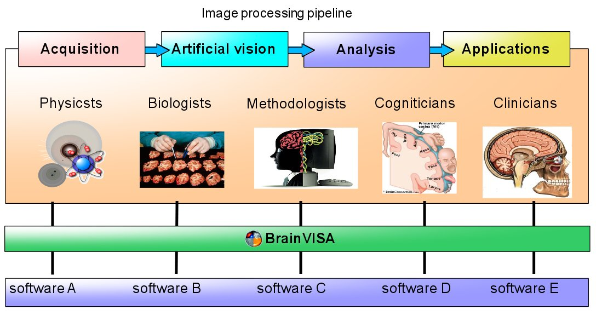

==================
Axon documentation
==================

Axon is the glue between the different parts of the `BrainVISA project <http://brainvisa.info>`_. It performs data management, software glue, distributed processing, and offers the main user interface for all software. It is open, and extensible through additional and optional toolboxes.

What's new ? :doc:`See the changelog <changelog>`

Users
=====

* :axon:`Introduction slides <intro_bv.pdf>`

* :axon:`User manual <bv_man/en/html/index.html>`

* :doc:`Tutorial <tutorial>`

* :axon:`GUI embedded main user documentation <en/help/index.html>`

Developers
==========

* :axondev:`Developers documentation <index.html>`

.. toctree::
  :hidden:

  tutorial
  morphologist_tutorial
  connectomist_tutorial
  changelog

