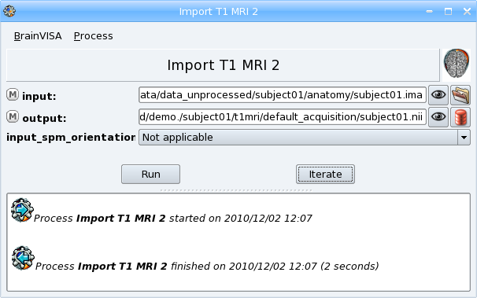
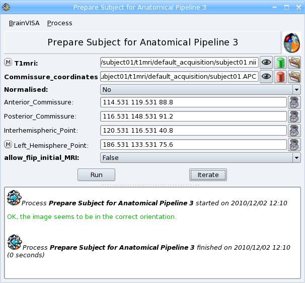
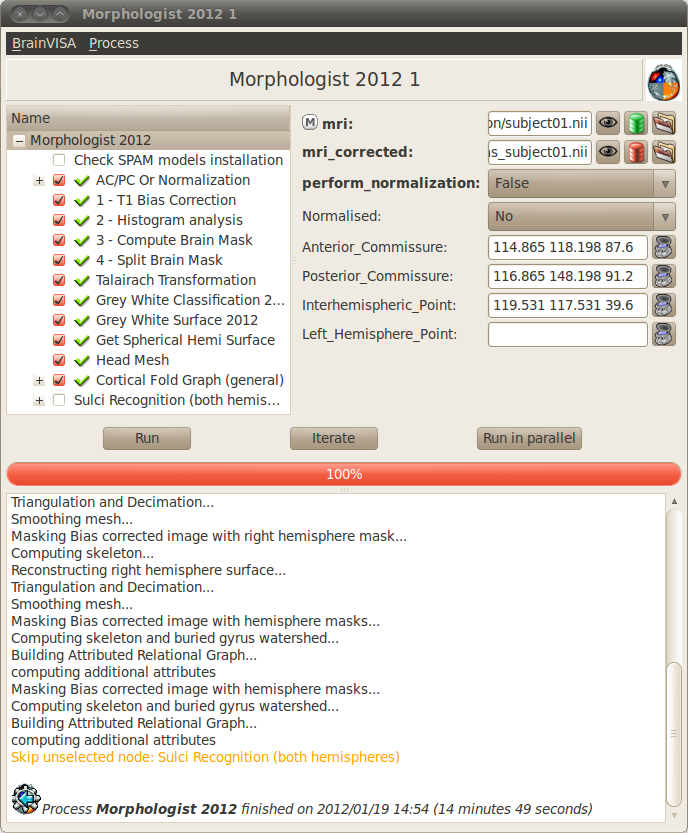
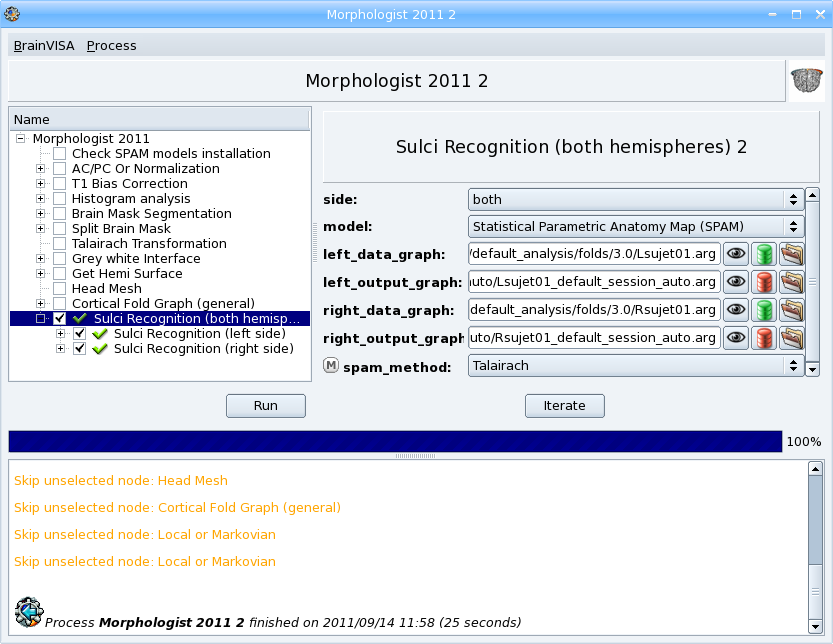
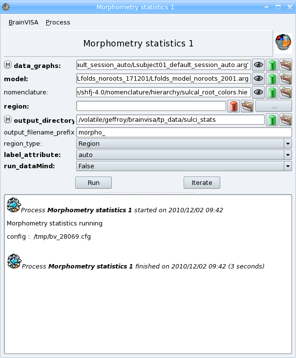
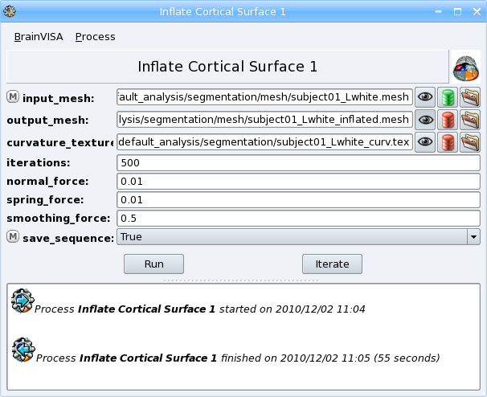
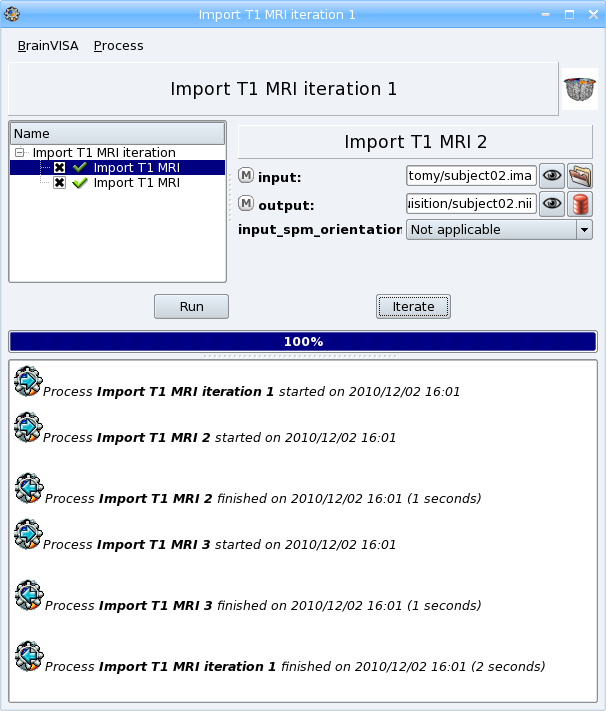
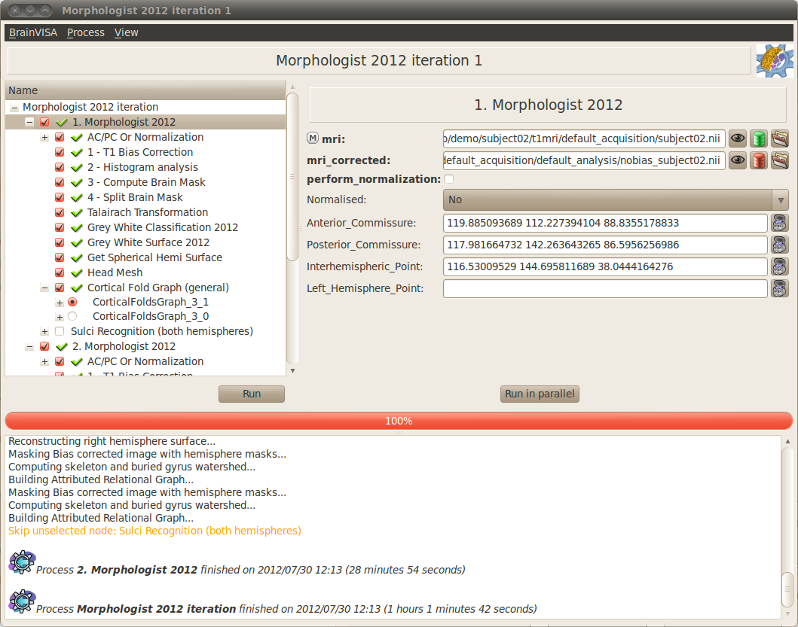
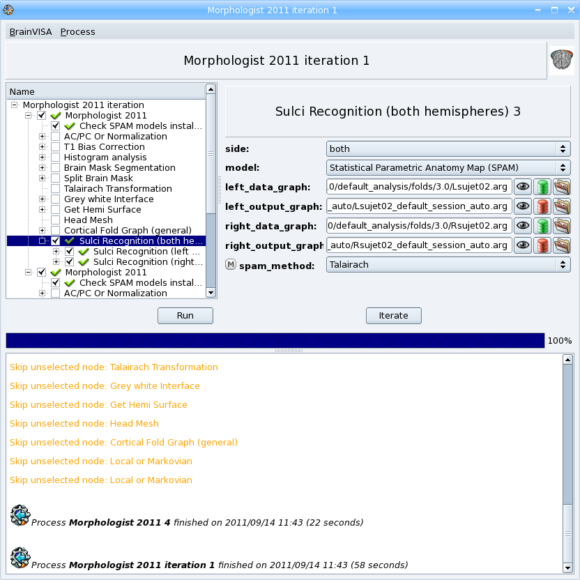

=====================
Morphologist tutorial
=====================

**T1 MRI data processing: Morphologist**

This tutorial is part of the :axonusr:`BrainVISA tutorial <tutorial.html>`. The basics of *BrainVisa* manipulation should be known when reading this part. A novice reader should start the complete tutorial from the beginning.

Introduction
============

In this practical work, we will use raw T1 MRI images of the human brain with 1mm resolution. We will use the BrainVISA Morphologist toolbox to process the data. From the raw data, we will do several processing steps: segmentation, 3D meshes construction, sulci extraction and identification, morphometry...

The main processing steps will be:

* **Data importation**: raw data importation in the BrainVISA database.
* **AC/PC spotting**: spotting these points gives reference points common to all subjects and enables to reorient the image if needed.
* **Segmentation pipeline (Morphologist)**: pipeline made up of several processing steps: bias correction, histogram analysis, brain mask segmentation, hemispheres segmentation, cortical surface and white matter surface 3D meshes construction, sulci extraction.
* **Sulci automatic recognition**: automatic labelling of sulci.

Then we will see a couple of other useful processes that can be applied to the previous results:

* **Morphometry statistics**: measures and information extraction about labelled sulci.
* **Inflate cortical surface**: computes an inflated cortical surface from an hemisphere white matter mesh got with the T1 pipeline. This inflated mesh can be used for visualization purpose.

.. |browse_write| image:: images/browse_write.png
.. |database_write| image:: images/database_write.png
.. |database_read| image:: images/database_read.png
.. |eye| image:: images/eye.png
.. |anat| image:: images/anat.png
.. |pencil| image:: images/pencil.png
.. |point| image:: images/point.png

Application: ``subject01``
==========================

.. _import_t1:

STEP 1: Data importation
------------------------

**Requirement**: if no database is setup yet, :axonusr:`add a database <tutorial.html#add-a-database>`

For more details about data importation, see :axonman:`BrainVISA manual - Data importation chapter <ch04s05.html#bv_man%importT1>`.

* Open the process *Morphologist => import => Import T1 MRI*.
* Select input data with |browse_write| icon: ``data_unprocessed/subject01/anatomy/subject01.ima``.
* Describe the output with |database_write| icon. You have to fill in several information fields for this data:

  * Select a format: for example *NIFTI-1 image*; the image will be converted to this format in the database directory.
  * Type a name for the *center* attribute: for example ``demo``
  * A suggested item appears in the right panel. Click on the *Ok* button to accept.

* Click *Run* button to start the process.

  T1 MRI importation

.. raw:: html

  

    

      <object type="application/x-shockwave-flash" data="_static/images/import_T1.swf" width="800" height="600">
        <param name="movie" value="_static/images/import_T1.swf"><param name="loop" value="true">
      </object>
    

    T1 MRI importation
  

.. note::

  In this example, the raw data is in *GIS format* but it is possible to import data which are in various formats including **Dicom**. To import a Dicom image, select the first file of the series as input. You may have to change the file filter to *All files (*)* in the file browser to see the Dicom files if they have not the extension *.dcm*. Data will be converted to *GIS* or *Nifti* format in BrainVISA database. See :axonman:`the paragraph about importation of Dicom images in BrainVISA manual <ch04s05.html#bv_man%import_dicom>` for more details.

.. note::

  some *DICOM* images are directories containing a set of files without extension. *BrainVisa* provides a specific *DICOM* importation process for this case: *Import Dicom T1 MRI*.

Browsing the database
+++++++++++++++++++++

The image has been copied in the BrainVISA database directory. Now, let us have a look at the database and its content:

* Click on the |eye| icon to visualize the output image with Anatomist. Click again on the button to close the visualization. Right-click on the button to open the viewer process associated to this type of data.

* Open the process *Data management => Database browser* to explore the database directory. Double-click on the database directory to see its content, open the subdirectories (``demo/subject01/t1mri/default_acquisition``) to find the imported image. Click on the image and see information about it in the right panel. Right-click on the image to open the contextual menu. Select view to vizualize the image with Anatomist. More information about the :axonman:`database browser in the BrainVISA manual <ch04s06.html#bv_man%db_browser>`.

.. _prepare_subject:

STEP 2: AC/PC spotting
----------------------

**Requirement**: if there is no T1 MRI in the database, `Import a T1 MRI <import_t1_>`_ first.

In this step, we are going to spot 4 points in the image: the anterior commissure, the posterior commissure, an inter-hemispheric point and a point of the left hemisphere. The spotted coordinates will be written in a .APC file which will be used during the Morphologist pipeline to compute a transformation to the Talairach AC/PC referential, which is useful to see several subjects images in a common referential.

.. note::

  **This step can be replaced by a normalization using SPM or FSL.** An alternative step using a normalization is offered in Morphologist pipeline if SPM or FSL is installed on your system.

  If you want to use the SPM normalization, you have to set the SPM paths in BrainVISA configuration. To do so, go to *BrainVISA menu -> Preferences -> SPM*. An *Auto detect* button is available to try and find the paths automatically.

This process is included in the Morphologist pipeline as a first step but it is also possible to run it separately.

* Open the process *Morphologist => Segmentation Pipeline => components => Prepare subject for Anatomical Pipeline*.

* Select input data with |database_read| icon. The output field *Commissures_coordinates* is automatically filled thanks to BrainVISA database system.

* In order to fill the coordinates ot the AC, PC points, click on the |anat| button. Anatomist starts and a window containing the T1 MRI image is opened. Scroll the slices of the image to find AC point, click on the point, then click on the &anat; button near *Anterior_commissure* field to copy the coordinates of the point. Do the same for the other points.

  **Be careful** for the left hemisphere point: *Anatomist* displays images in radiological mode by default, so left and right are inverted.

* The *allow_flip_initial_MRI* field by default does not allow to modify the image if it is not correctly oriented. You can change it to *True* if the image is not correctly oriented.

* Click on the *Run* button to start the process.

  Prepare subject for Anatomical Pipeline

.. raw:: html

  

    

      <object type="application/x-shockwave-flash" data="_static/images/prepare_subject.swf" width="800" height="600">
        <param name="movie" value="_static/images/prepare_subject.swf"><param name="loop" value="true">
      </object>
    

    T1 MRI importation
  

.. _morphologist:

STEP 3: Morphologist pipeline
-----------------------------

**Requirement**: `AC/PC spotting or normalization <prepare_subject_>`_

The anatomical pipeline is made of the following processing steps:

* **T1 Bias correction** (*mri_corrected*): Corrects for the spatial bias in usual MR images.
* **Histogram analysis** (*histo_analysis*): Analyses a T1-weighted histogram to estimate grey/white statistics.
* **Compute Brain mask** (*brain_mask*): Computes a binary mask of the brain from a bias corrected T1-weighted image from the histogram analysis.
* **Split brain mask** (*split_mask*): Splits the brain into three parts (hemispheres + cerebellum).
* **Talairach Transformation** (*Talairach_transform*): Computes a transformation between the image referential and the Talairach AC/PC referential.
* **Grey White classification**: Computes a mask of the grey and white matter (*left_grey_white* and *right_grey_white*).
* **Grey White Surface**: Computes a 3D mesh of the grey / white interface for each hemisphere (*left_white_mesh* and *right_white_mesh*).
* **Grey Spherical Hemi Surface**: Computes a 3D mesh of the external surface of the cortex for each hemispheres (*left_hemi_mesh* and *right_hemi_mesh*).
* **Head mesh** (*head_mesh*): Creation of the head mesh. Mainly useful for visualization purpose.
* **Cortical fold graph** (*left_graph* and *right_graph*): Builds a graph representation of the cortical folds for each hemisphere.
* **Sulci recognition**: automatic labelling of the sulci. It is not selected by default because it can take a long time.

For more information about the pipeline steps, see the :morphologist:`slides of a presentation about the Morphologist pipeline <morphologist.pdf>`.

Running the pipeline
++++++++++++++++++++

To run the pipeline:

* Open the process *Morphologist => Morphologist 2013*. This version of the pipeline is new since *BrainVisa* version 4.2.0, and is regularly updated in later versions. The older pipelines can still be found in *Segmentation pipeline => Older pipelines*.

* Select the input T1 MRI with the |database_read| icon.
* All the other parameters are automatically filled in.
* Unselect the first step AC / PC or normalization because it is already done.
* Click *Run* button to start the process.

  Morphologist pipeline

Saving the state of the process
+++++++++++++++++++++++++++++++

It can be useful to keep a trace of the processes applied to data. To do so, you can save a process with its parameters and options in a file:

* In the process window, select *Process => Save* menu.
* Choose a file name and location (eg. ``t1_pipeline_subject01.bvproc``) and click on the *Save* button.
* The saved process can be loaded through *BrainVISA => Open process* menu.

Results visualization
+++++++++++++++++++++

Once a step is finished, its results are written and can be visualized.

* Select a step of the pipeline, its parameters appear in the right panel.
* Click on the |eye| button near each output data (indicated by the &database_write; icon) to visualize it.
* Click again on the |eye| button to close the visualization.

What to do when the T1 pipeline fails ?
+++++++++++++++++++++++++++++++++++++++

The new Morphologist pipeline has been greatly improved and should succeed on most images. In case it fails, here are a few advices:

First, let us find which step has failed:

* Look at the error message and find the name of the step which has failed.
* Select the steps before the one that failed and visualize their output parameters to see if there are abnormal results.

To find out what happened, you can also read BrainVISA log: click on *BrainVISA => Show log* menu. A window showing the historic of  processes started in the current session appears.

Brain mask manual correction
++++++++++++++++++++++++++++

If the automatic segmentation is not perfect, it is possible to correct it manually.

* Select the brain mask segmentation step for ``subject03``
* Click on the |pencil| button near the *brain_mask* parameter.
* A popup window indicating *Click here when finished* appears. You will have to click here when the correction is done. For the moment, reduce it.
* The brain mask is loaded in Anatomist as an editable region of interest named *label_255*. It is shown in a 3D window on the T1 MRI image.
* In the Anatomist toolbox window, change the brush in the *Paint* tab.
* Add voxels to the mask by maintaining left click and moving the mouse.
* Remove voxels from the mask by pressing Ctrl key while drawing.
* Fix the mask by removing some voxels outside the brain.
* When the correction is over, click on the *Ok* button of the dialog window indicating *Click here when finished*.
* The modified mask is saved.

.. warning::

  After a manual correction, do not start again the brain mask segmentation step, else the corrected mask will be erased. To be sure to not erase by mistake a data, it is possible to lock using the contextual menu *lock*. More information about this :axonman:`locking feature in the BrainVISA manual <ch03s05.html#bv_man%parameter_menu>`.

More information on the drawing tools of *Anatomist* is available in :anatomist:`The Anatomist ROI toolbox documentation <user_doc/anatomist_manual2.html#roi-drawing-toolbox>`.

.. _sulci_recog:

STEP 4: Automatic sulci recognition
-----------------------------------

**Requirement**: `Morphologist pipeline <morphologist_>`_ to obtain sulci graphs.

Sulci identification is available as the last step of the Morphologist pipeline but it can also be run as a separate process. The process is in *Morphologist => Sulci => Recognition => Sulci Recognition (both hemispheres)*.

This step is disabled by default since all users do not need it, and it takes some time to run (about 10-20 minutes on a standard computer).

* In the Morphologist pipeline window, once it is finished, check the box near the *Sulci recognition* step.
* Right-click to open the contextual menu and choose *Unselect before* to unselect all the previous steps that are already done.
* In the parameters panel of Sulci recognition process, select *Statistical Parametric Anatomy Map (SPAM)* for the model.
* Select *Talairach* for the *spam_method* parameter.
* Click *Run* button to start the process.
* When the process is finished, visualize the results.

.. warning::

  The SPAM recognition requires the installation of the SPAM models which are not included in the main BrainVISA package because of their size. These models are in additional packages downloadable on the Brainvisa website. They can be easily installed thanks to the process *Morphologist -> Sulci -> Recognition -> SPAM models installation*. Anyway, a process that checks this installation is now automatically selected as a first of the Morphologist pipeline when the sulci recognition is selected. If the models are not found, Brainvisa will suggest you to install them.

  Sulci recognition

STEP 5: Morphometry statistics
------------------------------

**Requirement**: `Automatic recognition <sulci_recog_>`_.

This process does not actually make statistics, it only gives some descriptors on regions, according to a model. This process has been primarily written for cortical folds graphs and it is still its main usage, but it can also be used to obtain descriptors for gyri or ROIs.

The input sulci graphs must be labelled. The outputs will be one CSV file for each sulcus with one line per subject.

* Open the process *Morphometry => Morphometry statistics*.
* Select the input data_graphs with |database_read| button: choose a labelled cortical folds graph of the subject we have just processed (``subject01``).
* The model is automatically filled in, it depends on the type of graph chosen. For example, the model is not the same for the left and right hemisphere because they does not have the same sulci.
* Choose the *output_directory* with |browse_write|: a directory where the results files will be written. For example, create a new directory named ``sulci_stats`` in your personal directory.
* Click on the *Run* button to start the process.
* Once the process is finished, go to the output directoy and open one of the results file with a text editor. The file can also be opened with a spreadsheet software (eg. Excel) to compute statistics.

.. note::

  It is generally more useful to run this process on several subjects to compare their sulci descriptors. We will do that in a next part: `Sulci descriptors comparison <sulci_desc_comp_>`_.

  Morphometry statistics on sulci

Getting information about the model
+++++++++++++++++++++++++++++++++++

In order to have information about the descriptors computed in this process, you can run the viewer of the model. It displays a documentation about the model and the associated descriptors.

To do so:

* Click on the |eye| button near the *model* parameter.
* If you cannot see the button, go to the preferences panel and change to user level to *Expert*. This viewer is in expert user level, so when the level is set to basic, you cannot see it.
* Read the documentation to find the name of the descriptor for the depth of the sulci.

STEP 6: Inflating cortical surface
----------------------------------

**Requirement**: `Anatomical pipeline <morphologist_>`_ to obtain segmented cortical hemispheres and meshes.

This process inflates the cortical surface for visualization purpose. It can be used for example to visualize an activation map on the cortical surface with Anatomist. The input mesh must have a spherical topology, otherwise the inflate algorithm may fail. Grey/white cortical interface meshes processed by Morphologist are guaranteed to satisfy this condition. Pial meshes also satisfy this topological constraint since Morphologist 2013.

* Open the process *Morphologist => surface => Inflate cortical surface*.
* Select an *Hemisphere White mesh* of ``subject01`` as *input_mesh* with the |database_read| button.
* Select *True* for the *save_sequence* parameter. The intermediate steps of deformation will be saved in a 4D mesh.
* Click on the *Run* button to start the process.

The process has two outputs: the inflated mesh (*output_mesh*) and a texture containing information about the curvature of the surface.

Once the process is finished, visualize the results by clicking on the |eye| button near the *output_mesh* parameter. The viewer opens the inflated mesh with the curvature texture applied on it. Move the slider to scroll through the deformation steps of the mesh.

  Inflate cortical surface

Processing several subjects: ``subject02`` and ``subject03``
============================================================

.. _iter_import_t1:

Import several images
---------------------

**Requirement**: if no database is set, :axonusr:`add a database <tutorial.html#add-a-database>`.

To repeat the same process on several data, the *Iterate* feature of BrainVISA is useful.

For more details about iteration of an importation process, see :axonman:`BrainVISA manual - Data importation <ch04s05.html#bv_man%iter_importT1>`

* Open the process *Morphologist => import => Import T1 MRI*.
* Click on the *Iterate* button.
* Fill in the *input* parameter using the |browse_write| button:

  * Select ``data_unprocessed/subject02/anatomy/subject02.ima``.
  * Click again on the |browse_write| icon to add the next image: ``data_unprocessed/subject03/anatomy/subject03.ima``.
  * Click on the *Ok* button to end the selection of input files.

* Fill in the *output* parameter using the |database_write| icon. This time, you have to give information for several images:

  * Select a format: for example *NIFTI-1 image*; the images will be converted to this format in the database directory.
  * Select the *center* created for the first importation: ``demo``
  * For the *subject* attribute, you have to enter 2 different values for the 2 input images. Type in the *subject* field: ``subject02 subject03``.
  * Two suggested items appear in the right panel. Select the two items (Ctrl+click) and click the *Ok* button to accept.

* Click *Ok* in the iteration dialog
* A new window named *Import T1 MRI iteration* appears. It is a pipeline containing an instance of the importation process for each image to be imported.
* Click on the *Run* button to start the process.

  Import T1 MRI Iteration

.. _iter_morphologist:

Anatomical pipeline iteration
-----------------------------

**Requirement**: `Import several images <iter_import_t1_>`_.

Now, we are going to process the new MRI data for subject02 and subject03. It is possible to create an iteration of the Morphologist pipeline:

* Select the process *Morphologist 2013*
* Right-click to open a contextual menu and select *Iterate*
* Fill in the *mri* parameter with the |database_read| button and select the *Raw T1 MRI* of ``subject02`` and ``subject03``.
* Click on the *Ok* button to generate the iteration
* For each instance of Morphologist in the iteration process, fill in the AC, PC, interhemispheric and left hemisphere points parameters.
* Start the iteration process by clicking on the *Run* button

  Anatomical pipeline Iteration

.. _iter_sulci_recog:

Automatic sulci recognition iteration
-------------------------------------

**Requirement**: `Morphologist pipeline iteration <iter_morphologist_>`_ to obtain sulci graphs.

* Open the Morphologist pipeline window
* Check the box near the *Sulci recognition* step.
* Right-click to open the contextual menu and choose *Unselect before* to unselect all the previous steps that are already done.
* In the parameters panel of Sulci recognition process, select *Statistical Parametric Anatomy Map (SPAM)* for the model.
* Select *Talairach* for the *spam_method* parameter.
* Click on the *Iterate* button to open the *Morphologist pipeline* iteration parameters window.
* Fill in the *mri* parameter with |database_read| button and select the Raw T1 MRIs of ``subject02`` and ``subject03``.
* Click on the *Ok* button to generate the iteration
* Start the iteration process by clicking on the *Run* button
* When the process is finished, visualize the results.

.. note::

  The steps and parameters that are selected in the first process window are reported in the generated iteration of processes. This way, you can fix the common parameters once instead of changing them in each generated process.

  Sulci recognition

.. _sulci_desc_comp:

Sulci descriptors comparison
----------------------------

**Requirement**: `Automatic sulci recognition iteration <iter_sulci_recog_>`_.

-----

  **Exercise:**

  Compute the mean depth of the left central sulcus for the 3 subjects of our database.

-----

To do so, here are the steps to follow:

* Open the process *Morphometry => Morphometry statistics*.
* Select the input data_graphs with the button |database_read|: choose the automatically labelled left cortical folds graphs of the 3 subjects in our database.
* Click on the button |point| near the *region* parameter to select the sulci of interest.
* A new *Labels selector* window opens. Select the sulcus named *S.C._left* in the list. Drag and drop it in the selection panel just below.

  .. figure:: images/select_sulci.png
    :align: center

    Labels selector window

* Click on the *Accept* button to close the window.
* Choose the output_directory with the button |browse_write|: a directory where the results files will be written. For example, create a new directory named *sulci_stats* in your personal directory.
* Click *Run* button to start the process.
* Once the process is finished, go to the output directoy.
* Right-click on the ``.dat`` file and opens it with a spreadsheet software.
* The sofware should offer to cut the fields on the file into columns. Accept it.
* Compute ``sum( geodesicDepthMax - geodesicDepthMin )/3``

.. warning::

  The language settings of the spreadsheet software have an influence on the way the numbers are interpreted. The file generated by Brainvisa writes decimal numbers with a dot character (eg. 1.5) which is the english standard. Whereas in french for example, the decimal numbers are written with a comma (eg. 1,5).

