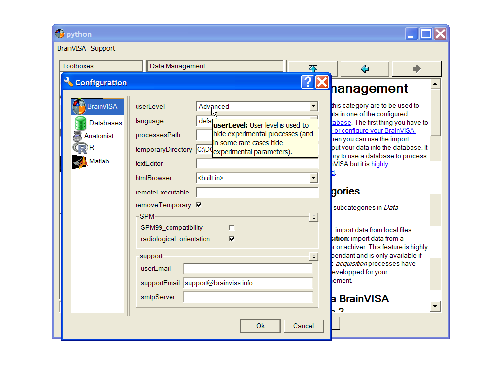
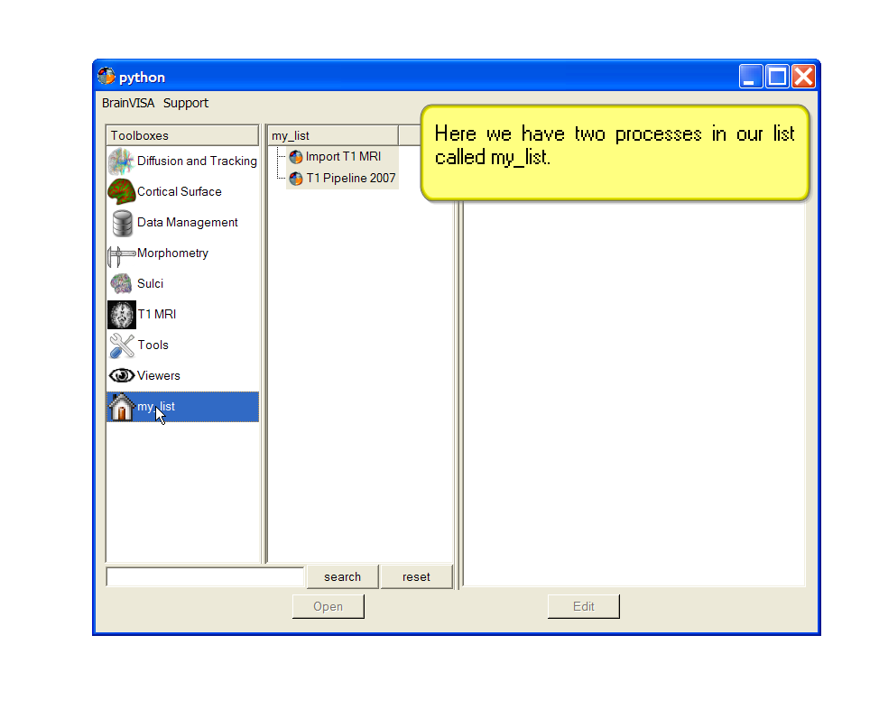
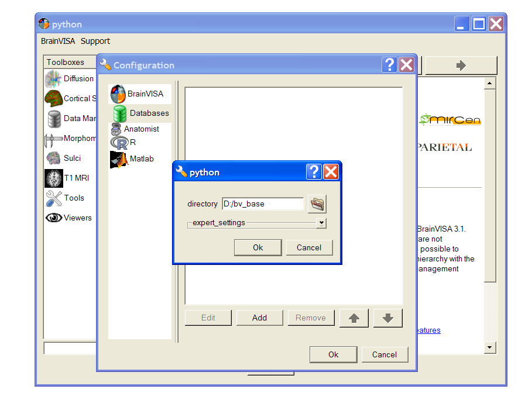
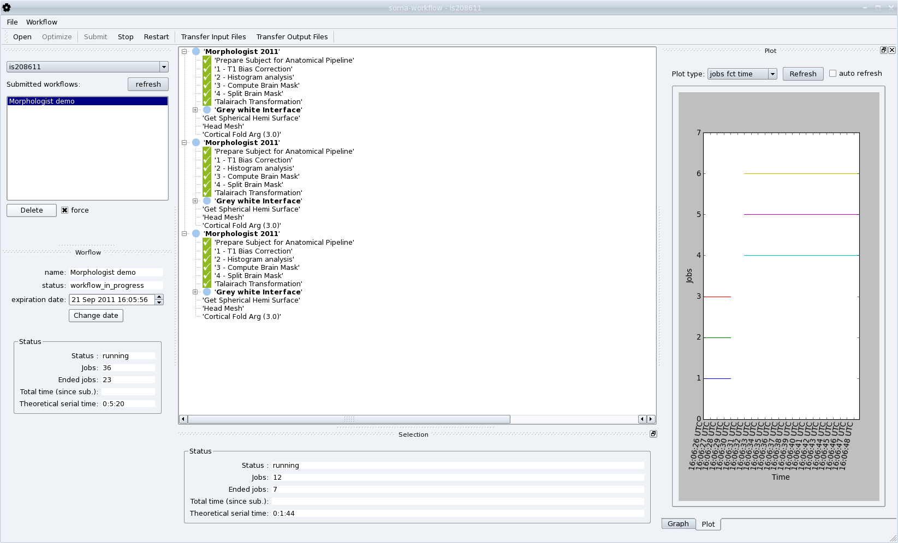
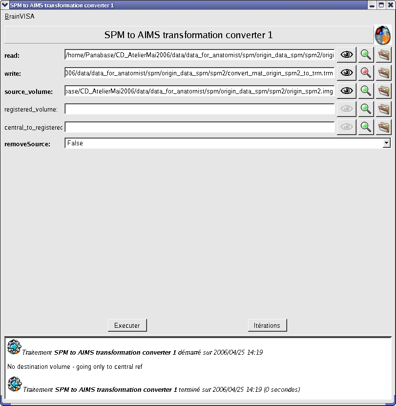

=======================
BrainVISA Axon tutorial
=======================

Introduction
============

.. note:: Disclaimer

  All contributors of BrainVISA project are very happy to propose tools, libraries, demonstration data and documentation available free of charge on http://brainvisa.info. The BrainVISA project is focused on neuroimaging and the development of tools only in a context of research. Although every care has been taken by all contributors of the BrainVISA project no warranty can be given in respect of the accuracy, reliability, up-to-dateness or completeness of the information contained within BrainVISA project. In the same way no one will be responsible or liable for any loss or damage of any sort.

  Any contributor reserves the right to alter or remove the content, in full or in part, without prior notice.

BrainVISA is a modular and customizable software platform built to host heterogeneous tools dedicated to neuroimaging research. Many toolboxes have already been developped for BrainVISA (T1 MRI, sulcal identification and morphometry, cortical surface analysis, diffusion imaging and tractography, fMRI, nuclear imaging, EEG and MEG, TMS, histology and autoradiography, etc.).

BrainVISA main features are:

* Harmonization of communications between different software. For instance, BrainVISA toolboxes are using home-made software but also third-party software such as FreeSurfer, FSL, SPM, nipy, R-project, Matlab, etc.
* Ontology-based data organization allowing database sharing and automation of mass of data analysis.
* Fusion and interactive visualization of multimodal data (using Anatomist software).
* Automatic generation of graphical user interfaces.
* Workflow monitoring and data quality checking.
* Full customization possible.
* Runs on Linux, Mac and Windows.

BrainVISA is developped by french governement founded research organizations (mainly CEA, INSERM, INRIA, CNRS) grouped in a federative research institute: IFR 49. It is a free and open-source software written in Python script language and can be downloaded from: http://brainvisa.info.

See the slides of an introduction to BrainVISA: :axon:`BrainVISA Advanced Training - Introduction <intro_bv.pdf>`

BrainVISA is available for free download here: http://brainvisa.info/downloadpage.html. Installation instructions: http://brainvisa.info/download.html#installation and the :axon:`BrainVISA manual <bv_man/en/html/index.html>`.

In this tutorial, we will use demonstration data that are available for download here: ftp://ftp.cea.fr/pub/dsv/anatomist/data/demo_data.zip.

General features
================

This chapter deals with *BrainVisa* general features whichever toolbox is used.

Quick start
-----------

Here is a summary of the main steps that you need to follow to start with BrainVISA:

.. |eye| image:: images/eye.png

* **Create a database** where all data written by BrainVISA will be stored : *BrainVISA menu -> Preferences -> Databases -> Add button*. It is strongly advisable to use a database to process data with BrainVISA. Indeed, some important features are not available when you are using data outside a database. More information about databases in the :axonman:`Databases and ontology <ch04.html#bv_man%database>` chapter of the BrainVISA user manual.

* **Import raw data**: *Data Management toolbox -> import...* Choose the process according to the type of data. Select raw data with |browse_write|. Fill in the database attributes using |database_write|. The process will copy the data in the BrainVISA database.

* **Process data**: Open a process, enter the input parameters by selecting them in the database using |database_read|. BrainVISA automatically complete as many parameters as possible. Output data will be written in the database.

* **Visualize data** with |eye|

* **Iteration** of a process on a set of data with the *iterate* button in the process.

The log window
--------------

The log window enables the user to monitor all the actions performed by BrainVISA. It shows information about the configuration, the processes that have been run during and their parameters, the errors that occured during the session.

The information displayed in this window is stored in a file which you should therefore keep if you wish to submit an execution error to the BrainVISA support. In many cases, if this file is not available, the information submitted is not specific enough to enable the error to be understood or reproduced.

More information about the :axonman:`log window in the BrainVISA user manual <ch03s03.html#bv_man%log>`.

View the log window
+++++++++++++++++++

* *BrainVISA => Show Log*.

Save the log file
+++++++++++++++++

It can be useful to save *BrainVisa* log file for example when you get an error that you want to point out on the forum. It is better to send the log file to help us in understanding the problem.

* **Important**: Close the brainvisa session after that an error occured. If you save the file, before closing BrainVISA, it will not be readable.

* Windows: save the following file ``C:\Documents and Settings\<user>\.brainvisa\brainvisa.log``.

* Unix: save the following file ``/home/<user>/.brainvisa/brainvisa.log``.

The name of the log file can be *brainvisa<number>.log* if you have several brainvisa running on the same user account. The name of the log file is written in the console at BrainVISA starting.

Open a log file
+++++++++++++++

It is possible to see in the log window the content of a saved log file.

* *BrainVISA => Show Log*.
* Click on **Open**.
* Select the log file (dependent on OS).

.. _configuration:

Configuration
=============

You can change some options in BrainVISA via the menu *BrainVISA => Preferences*. Particularly, change the **user level** if you want to see all the processes. By default, the user level is *Basic*, so you only see basic processes.

See the :axonman:`Preferences window chapter in BrainVISA user manual <ch03s02.html#bv_man%pref>` for more information about BrainVISA options.

.. raw:: html

  

    

      <object type="application/x-shockwave-flash" data="_static/images/change_userlevel.swf" width="974" height="808">
        <param name="movie" value="_static/images/change_userlevel.swf"><param name="loop" value="true">
      </object>
    

    Changing user level
  

.. _bookmarks:

Manage bookmarks
================

The left panel of BrainVISA shows the list of available toolboxes. You can create here a new custom toolbox to store bookmarks on the processes that you most frequently use. To create such a bookmarks toolbox, use the contextual menu on the toolboxes panel.

More information in the :axonman:`Custom Toolbox chapter in BrainVISA user manual <ch03.html#bv_man%bookmarks>`.

.. raw:: html

  

    

      <object type="application/x-shockwave-flash" data="_static/images/processes_list.swf" width="974" height="808">
        <param name="movie" value="_static/images/processes_list.swf"><param name="loop" value="true">
      </object>
    

    Changing user level
  

.. _add_datab:

Add a database
==============

When you run brainvisa for the first time, a message box appears inviting you to create a new database. Click on the *Open preferences* button to go to the preferences panel. You can also go the preferences panel once BrainVISA is started through the *BrainVISA => Preferences* menu.

* In the preferences window, choose the *Databases* tab
* Click on the *Add* button to add a new database directory.
* Click on the |browse_write| icon to select a directory.
* Create a new directory, give it a name (eg. brainvisa_database), select it and click *Choose* button.
* Click *Ok* button. The database is added.
* Click *Ok* at the bottom of the preferences panel to close it.

.. raw:: html

  

    

      <object type="application/x-shockwave-flash" data="_static/images/add_database.swf" width="974" height="808">
        <param name="movie" value="_static/images/add_database.swf"><param name="loop" value="true">
      </object>
    

    Changing user level
  

T1 MRI data processing: Morphologist toolbox
============================================

This tutorial shall now be continued with :morphologistusr:`Morphologist tutorial <morphologist_tutorial.html>`.

When this is done, you may continue to the next section.

Diffusion data processing: Connectomist toolbox
===============================================

This tutorial shall now be continued with :connectomistusr:`Connectomist-1 tutorial <connectomist_tutorial.html>`.

When this is done, you may continue to the next section.

Cyril Poupon's **Connectomist-2** should replace Connectomist-1, but is still not ready for public distribution.

Histological data processing: BrainRAT
======================================

This tutorial shall now be continued with :brainrat:`BrainRAT manual <index.html>`.

When this is done, you may continue to the next section.

Parallel computing with Soma-workflow
=====================================

:somaworkflow:`Soma-workflow <index.html>` is a unified and simple interface to parallel computing resources. It is an open source Python application which aims at making easier the use of parallel resources by non expert users and external software.

This tool is included in BrainVISA package since version 4.1.0 and is really integrated in BrainVISA graphical user interface since version 4.2.0. It can be used to easily distribute BrainVISA iterations on a multi-core machine or on a cluster.

See the :axonman:`chapter about Soma-workflow in BrainVISA manual <ch06.html#bv_man%soma-workflow>` for more details about using this tool within BrainVISA.

Distributing a Morphologist iteration on a multi-core machine
-------------------------------------------------------------

.. |icon_process_0| image:: images/icon_process_0.png
  :height: 24px

Using *Soma-workflow* in *BrainVISA* to distribute processes execution on a mutli-core machine is very easy and does not need any particular configuration steps. The execution can be really faster if the machine has several processors. Indeed, by default BrainVISA uses only one processor.

In the following example, we are going to use Soma-workflow to run the Morphologist pipeline on the 3 subjects of our database:

* Go to the BrainVISA preferences panel and check the userLevel, it must be at least Advanced else the feature is not available.

* Create an iteration of the Morphologist pipeline on the 3 subjects of our database. See :ref:`Anatomical pipeline iteration <iter_moprhologist>` to know how to do that.

* Click on the *Run in parallel* button.

  .. image:: images/run_in_parallel.png

* A new dialog window appears. Choose a name for the workflow *name parameter*.

* Click on the *Ok* button.

  .. image:: images/workflow_submit.png

* A new window appears to enable monitoring the execution of the workflow.

  .. image:: images/iteration_workflow.png

* When the workflow execution is finished, use the menu *Process -> Check & update databases* to update the database. Indeed, Soma-workflow runs BrainVISA in a batch mode to execute each job and in this mode, some features linked to BrainVISA databases are disabled. So you may need to check and update your databases after a parallel run with Soma-workflow.

* Open the corresponding BrainVISA process by clicking on the |icon_process_0| icon in the toolbar at the top of the window. It is useful to visualize the results of the process for example.

  .. image:: images/iteration_workflow_process.png

.. warning::

  Do not close BrainVISA while the workflow is not finished, it would stop its execution.

Using Soma-workflow graphical user interface
--------------------------------------------

Soma-workflow also has its own graphical user interface and it is possible to use it to visualize a BrainVISA workflow:

* Run the program *soma_workflow_gui*. It is included in the BrainVISA package in the *bin* directory.
* The graphical interface of Soma-workflow appears. Click on the *Ok* button in the connection dialog. The default selected resource is the local machine and it does not need any login/password information.
* The workflow submitted via BrainVISA should appear in the list of submitted workflows.
* Click on the workflow name to visualize it.
* Unroll the workflow items to follow the execution of the morphologist pipelines.

  Soma-workflow GUI

For more information about Soma-workflow, see its :somaworkflow:`documentation page <index.html>`.

Other tools
===========

.. _convert_matTOtrm:

Converting SPM registration and normalization matrices to AIMS
--------------------------------------------------------------

It may be useful if you want a transformation generated by SPM in the form of a ``.mat`` file to be readable by BrainVISA and Anatomist.

* Open *Converters => automatic => SPM to AIMS transformation converter*
* **read** parameter: click on |browse_write| and choose the ``.mat`` file.
* **write** parameter: click on |browse_write| and choose a path/name for the ``.trm`` file.
* **source_volume** parameter: click on |browse_write| and indicate the anatomical volume.
* Click on **Run** to launch the conversion process.

  SPM ``.mat`` to AIMS ``.trm`` conversion

----------

.. _iter_moprhologist:
